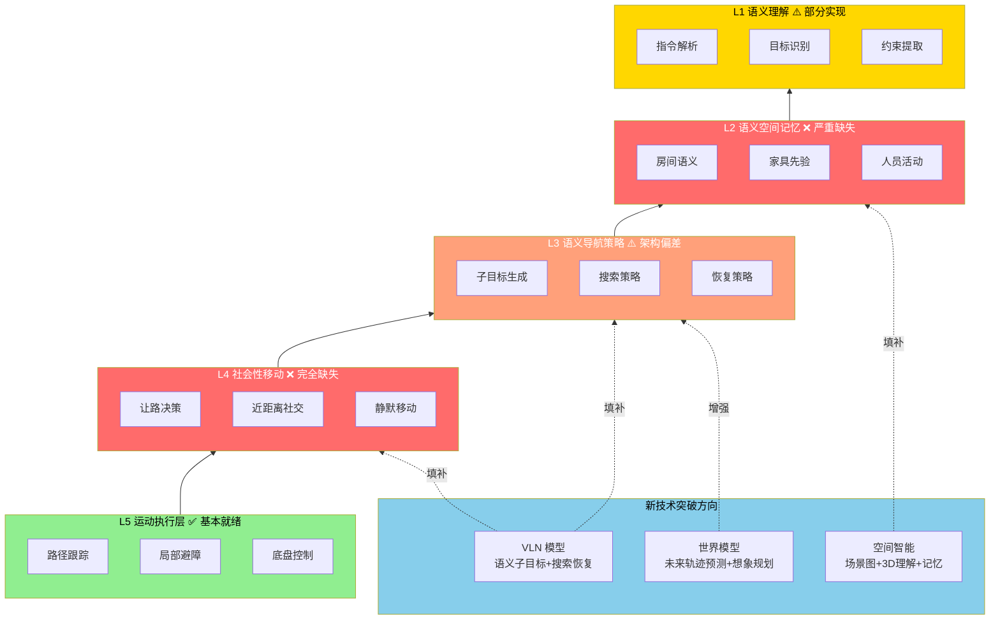
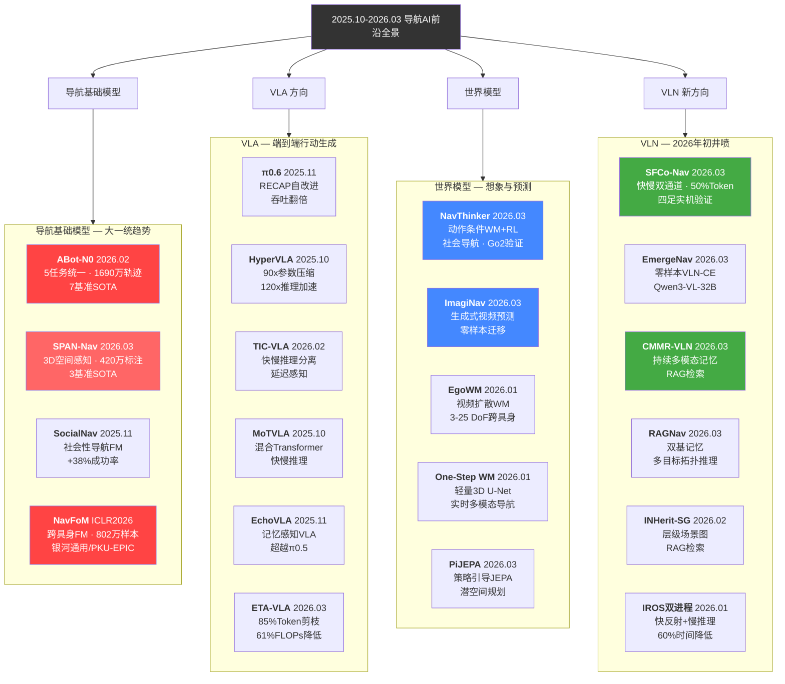
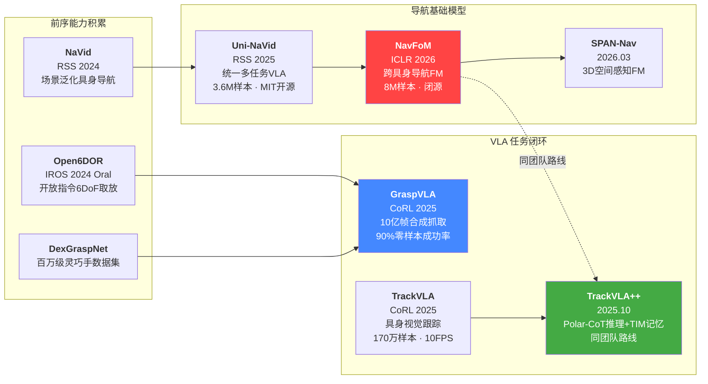
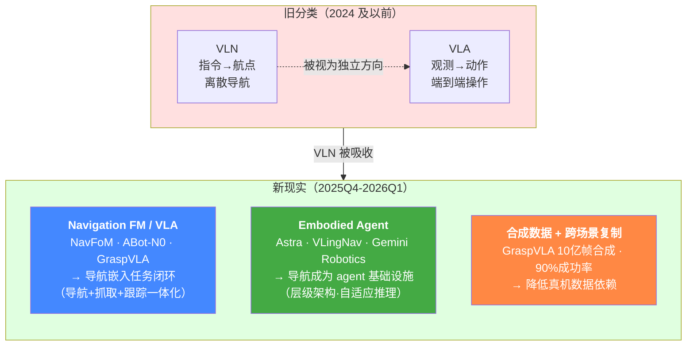
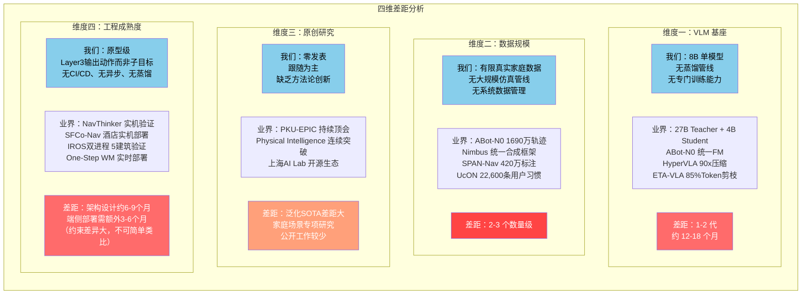
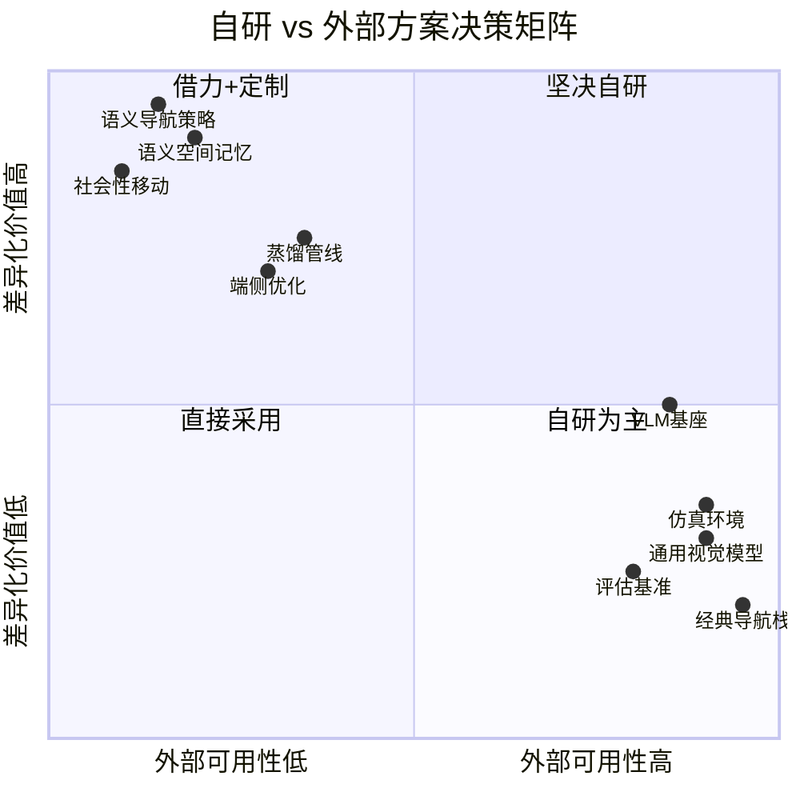
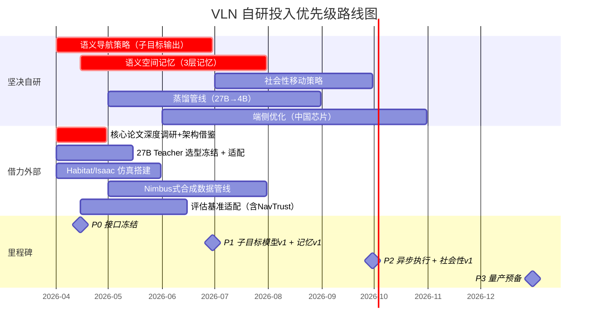
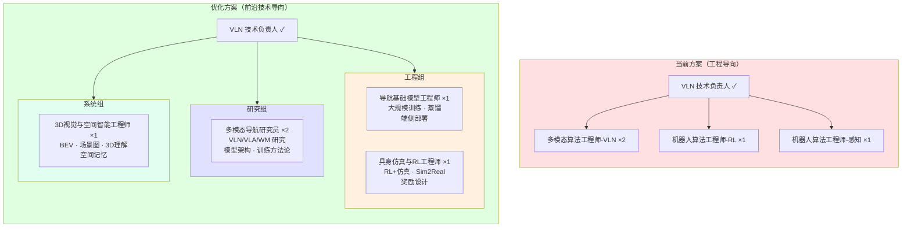
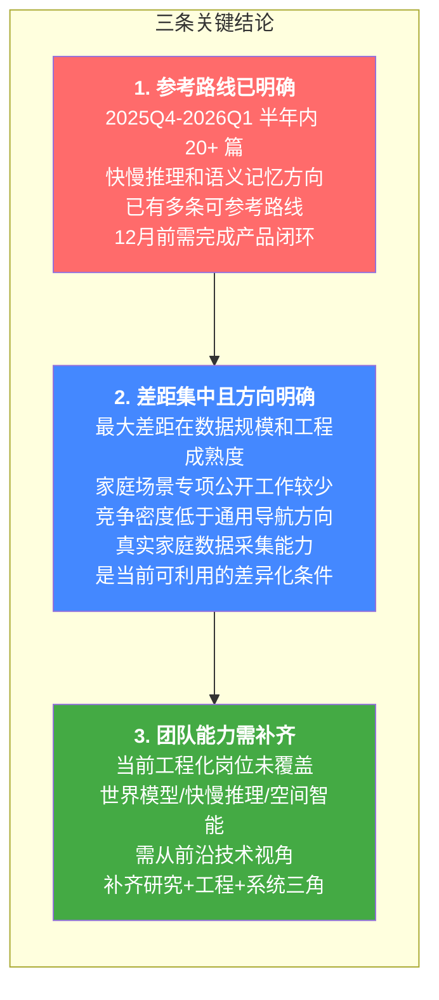

# Kinbot VLN 后续研究规划

---

文档版本：v2.5
创建日期：2026-03-31
作者：Codex-VLN技术专家
状态：内部评审稿

### 变更记录

| 版本 | 更新日期 | 更新人 | 主要变更 |
|------|---------|--------|---------|
| v1.0 | 2026-03-31 | Codex-VLN技术专家 | 初稿，覆盖六章框架 |
| v2.0 | 2026-03-31 | Codex-VLN技术专家 | 新增 NavFoM/银河通用深度分析（§2.3.5）；重写开源分级表（§4.5）；修正 PKU-EPIC/ABot-N0 归属错误；重写 VLN-vs-VLA 为"标签融合"叙事（§2.4）；新增约束归一化可迁移性评估（§3.5） |
| v2.1 | 2026-03-31 | Codex-VLN技术专家 | Teacher 选型改为"两周内冻结"；修正 NavFoM 部署 GPU 型号；机会矩阵降级表述；压缩银河通用公司情报；规范文档头部格式 |
| v2.2 | 2026-03-31 | Codex-VLN技术专家 | 重写 §2.3.5 银河通用为完整 VLA 闭环分析（+GraspVLA/TrackVLA/TrackVLA++）；新增 §2.3.6 字节 Seed（VLingNav/Astra）；重写 §2.4 VLN 热度下降四因分析；重写 §2.5 为 8 大经典问题域矩阵；新增 MapNav 已复现标注；Uni-NaVid 降级为架构参考 |
| v2.3 | 2026-03-31 | Codex-VLN技术专家 | 修正 Open6DOR 会议为 IROS 2024（非 ICRA 2025）；TrackVLA++ 移除"基于 NavFoM 构建"改为"同团队路线"；论文简称补充正式标题（IROS 双进程、Token 剪枝 VLN、最优视野社会导航）；MapNav "已复现"标注为内部状态；VLN方向招聘 3→2 人 |
| v2.4 | 2026-03-31 | Codex-VLN技术专家 | 去 AI 味第一轮：§2/3/6 战略判断腔降级；"极度相关/高度相关"→约束分类（L2/L3/L4）；"全行业空白/弯道机会/独有护城河"→"公开工作较少/竞争密度低/可利用的差异化条件" |
| v2.5 | 2026-03-31 | Codex-VLN技术专家 | 去 AI 味第二轮：§1.1 "经典导航已触顶"→工程化表述；§2.3.5 "战略意图/证据最强"→论文序列事实描述；§2.4 "深层原因/关键证据"→"可观察变化"；删除"图表（插入）"模板；"一句话概括"→直接陈述 |

---

## 目录

- [第一章：新技术投入的价值与必要性](#第一章新技术投入的价值与必要性)
- [第二章：机会差距 — 业界突破与未解问题](#第二章机会差距--业界突破与未解问题)
- [第三章：业绩差距 — 我们与业界的距离](#第三章业绩差距--我们与业界的距离)
- [第四章：自研投入策略 — 自研 vs 外部方案](#第四章自研投入策略--自研-vs-外部方案)
- [第五章：岗位优化建议 — 从工程视角到前沿技术视角](#第五章岗位优化建议--从工程视角到前沿技术视角)
- [第六章：总结与行动建议](#第六章总结与行动建议)

---

## 第一章：新技术投入的价值与必要性

### 1.1 问题背景

> **仅靠经典导航无法覆盖 Kinbot 的寻物/寻人/跟随/恢复需求，需要引入语义理解、空间记忆和社会性移动能力。**

Kinbot 是面向家庭室内场景的智能移动交互机器人，售价定位 20,000-30,000 元，目标 2026-12-31 达到量产预备状态。其导航需求包括"理解去哪里、找什么、找谁、先搜哪里、找不到如何恢复"，这些超出经典 SLAM + 路径规划的能力范围。

### 1.2 VLN 在 Kinbot 中的定位

Kinbot 采用 OODA（Observe-Orient-Decide-Act）架构。VLN 位于 Orient → Decide 之间，作为语义导航策略层，不直接控制底盘运动：

- **VLN 负责**：理解用户要去哪里、找什么、找谁、先搜哪里、找不到如何恢复、跟随时如何保持目标
- **VLN 输出**：语义子目标、搜索策略、跟随约束和重规划建议
- **Act 层（mobility_navigation）负责**：路径跟踪、局部规划、避障、限速和急停

当前原型直接输出底盘动作，目标是改造为输出语义子目标的策略系统，具备空间记忆、搜索恢复和社会性移动能力。

### 1.3 当前方法的四大局限

基于内部技术评估，当前原型存在四大核心局限：

| 局限 | 具体表现 | 根因 |
|------|---------|------|
| **推理慢** | 8B 模型端侧 TTFT >1s，走走停停 | 缺乏异步执行机制，模型未做蒸馏/量化 |
| **走得犹豫** | 频繁停顿等待推理结果 | 语义决策与运动执行强耦合，无快慢通道 |
| **无语义记忆** | 每次导航从零开始，不记得物品/人的位置 | 语义空间记忆层几乎空白 |
| **无社会性移动** | 不会让路、不懂近距离社交规范 | 社会性移动策略层完全缺失 |

### 1.4 五层能力架构与实现状态

Kinbot VLN 采用五层能力架构，各层当前实现状态如下：

| 架构层 | 定义 | 实现状态 | 缺口严重度 |
|--------|------|---------|-----------|
| **L1 语义理解层** | 指令解析、目标类型识别、约束提取、成功条件定义 | 部分实现（有基础 prompt 解析，但缺少指代消解、身份/权限上下文、显式约束结构） | 中 |
| **L2 语义空间记忆层** | 房间/家具/物品/人员位置先验、候选区域排序 | **严重缺失**（仅有基础地图/位姿，无语义场景图、无物品位置先验、无人员活动记忆） | **极高** |
| **L3 语义导航策略层** | 子目标生成、搜索动作序列、恢复策略 | **架构偏差**（当前模型直接输出底盘动作，而非语义子目标；接口 9 个字段中 8 个未实现） | **极高** |
| **L4 社会性移动策略层** | 让路决策、近距离社交规范、速度调节、静默移动 | **完全缺失**（接口完全未实现） | **极高** |
| **L5 运动执行层** | 底盘控制、路径跟踪、局部避障、执行状态反馈 | 基本实现 | 低 |

### 1.5 为什么需要 VLN / 世界模型等新技术



```
图表 1：技术价值金字塔 — 新技术如何填补五层架构缺口
```

### 1.6 经典导航 vs VLN 增强导航

| 维度 | 经典导航（SLAM + 路径规划） | VLN 增强导航 |
|------|--------------------------|-------------|
| **目标表达** | 坐标点 (x, y, θ) | "去厨房找药盒"、"找爷爷" |
| **空间理解** | 几何地图（占据栅格） | 语义地图（房间→家具→物品→人） |
| **搜索能力** | 无（只能到达已知坐标） | 候选区域排序 + 搜索策略 + 恢复 |
| **记忆能力** | 无（每次重建地图） | 物品位置先验、人员活动规律 |
| **社会性** | 无（障碍物=几何体） | 让路、近距离社交、静默移动 |
| **恢复能力** | 重规划路径（同一目标点） | 切换搜索区域、调整策略、求助 |

上表中右列的能力（语义目标、空间记忆、搜索恢复、社会性移动）是 Kinbot 在 20,000-30,000 元售价区间需要交付的产品能力，经典导航栈不覆盖这些。

---

## 第二章：机会差距 — 业界突破与未解问题

### 2.1 核心论点

> **2025Q4-2026Q1 半年内出现 20+ 篇导航相关论文，其中快慢推理分离和语义记忆两个方向与 Kinbot 约束匹配度最高。**

本章聚焦 **2025 年 10 月至 2026 年 3 月**发布的前沿研究。其中 NavFoM（PKU-EPIC / 银河通用）作为与 Kinbot 场景最相关的对标路线，在第 2.3.5 节单独展开分析。

### 2.2 技术全景图



```
图表 2：2025.10-2026.03 导航 AI 前沿技术全景图
```

### 2.3 重点工作深度分析

#### 2.3.1 导航基础模型 — "大一统"浪潮

**ABot-N0**（arXiv:2602.11598, 2026.02）是目前最具标志性的导航基础模型：
- **统一 5 类导航任务**：PointGoal、ObjectGoal、InstructionFollowing、POI-Goal、Person-Following
- **1690 万专家轨迹**训练
- **7 个基准 SOTA**，实现"Grand Unification"
- 表明统一架构 + 大规模数据的路线在导航领域可行

**SPAN-Nav**（arXiv:2603.09163, 2026.03）强调 3D 空间感知：
- 端到端注入占据预测（occupancy prediction）实现 3D 空间感知
- 420 万标注覆盖室内外场景
- 3D 空间理解与导航策略端到端融合的一个实例

**SocialNav**（arXiv:2511.21135, 2025.11; v2 更新 2026.02）填补社会性导航空白：
- 层级"脑-动作"架构 + SAFE-GRPO 流式 RL
- 成功率超 SOTA +38%，社会合规性 +46%
- Kinbot L4 社会性移动策略可参考其层级架构和 SAFE-GRPO 方法

#### 2.3.2 VLA 爆发 — 为什么热、与我们的关系

2025Q4-2026Q1 VLA 论文持续井喷，核心代表：

| 模型 | 时间 | 关键突破 | 与 Kinbot 的相关性 |
|------|------|---------|-------------------|
| **π0.6** | 2025.11 | RECAP 自我改进，任务吞吐翻倍 | 方法论参考：RL 自改进范式 |
| **HyperVLA** | 2025.10 | 90x 参数压缩、120x 推理加速 | 端侧部署：压缩方法可迁移到 4B 蒸馏管线 |
| **TIC-VLA** | 2026.02 | Think-in-Control：快动作/慢推理解耦，延迟感知 | L3 快慢通道：延迟感知解耦方案参考 |
| **MoTVLA** | 2025.10 | 混合 Transformer 快慢推理 | L3 快慢通道：混合推理架构参考 |
| **EchoVLA** | 2025.11 | 记忆感知 VLA，超越 π0.5 | L2 记忆：跨步记忆机制参考 |
| **ETA-VLA** | 2026.03 | 时间融合模块 + 稀疏聚合，85% Token 剪枝，61% FLOPs 降低 | 端侧部署：Token 效率参考（85% 剪枝数据可信，有对比实验） |
| **AsyncVLA** | 2025.11 | 异步流匹配 + 长程自校正 | L3 异步执行：流匹配 + 自校正机制参考 |
| **VLA-IAP** | 2026.03 | 免训练交互对齐剪枝，97.8% SR + 1.25x 加速 | 推理优化方法参考 |
| **InternVLA-M1** | 2025.10 | 空间引导训练 +14.6% | 空间理解训练方法参考 |

#### 2.3.3 世界模型 — 从概念到实用

2026 年世界模型在导航领域出现实质突破：

| 模型 | 时间 | 核心思路 | 成熟度 |
|------|------|---------|-------|
| **NavThinker** | 2026.03 | 动作条件 WM + RL，预测未来场景几何 + 人体运动 | **实机验证**（Unitree Go2） |
| **ImagiNav** | 2026.03 | 生成式视频模型"想象"未来轨迹 + 逆动力学 | 零样本迁移验证 |
| **PiJEPA** | 2026.03 | 策略引导 MPPI 规划 + JEPA 世界模型，潜空间导航 | CAST 数据集验证 |
| **EgoWM** | 2026.01 | 视频扩散 → 动作条件 WM，3-25 DoF 跨具身 | 多具身验证 |
| **One-Step WM** | 2026.01 | 3D U-Net 轻量 WM，一步生成 | 实时仿真+实机 |
| **DDP-WM** | 2026.02 | 解耦动力学预测，导航+操作+变形体 | 多任务验证 |
| **GRWM** | 2025.10 | 几何正则化解决长程漂移 | 仿真验证 |

NavThinker 在 Unitree Go2 上做了世界模型驱动社会导航的实机验证，ImagiNav 实现了从野外视频到机器人导航的零样本迁移，PiJEPA 将 JEPA 世界模型与策略引导规划结合。整体看，世界模型已从纯概念验证进入早期实机验证阶段，但仍限于受控场景下的原型验证，尚未在家庭等非结构化环境中大规模测试。

#### 2.3.4 VLN 2026 年初井喷 — 快慢分离与语义记忆两大主题

2026 年 1-3 月 VLN 领域出现明显的论文井喷（仅 3 个月超过 20 篇），两大核心主题浮现：

**主题一：快慢推理分离 — 解决"走得犹豫"问题**

| 模型 | 时间 | 核心突破 | 与 Kinbot 的关系 |
|------|------|---------|-----------------|
| **SFCo-Nav** | 2026.03 | 慢速 LLM + 快速属性图反应导航器，异步触发，50% Token 降低 | L3 快慢通道：纯 RGB + 实机验证（酒店场景），架构可参考 |
| **IROS: A Dual-Process Architecture**（双进程导航） | 2026.01 | 快反射 + 慢 VLM 推理，60% 行驶时间降低，5 栋建筑验证 | L3 快慢通道：纯 RGB、5 栋建筑验证，约束最接近 Kinbot |
| **slow4fast-VLN** | 2026.01 | 快慢交互推理框架，面向通用场景适应 | 快慢推理方法论参考 |
| **EmergeNav** | 2026.03 | 零样本 VLN-CE，Plan-Solve-Transition 结构化推理，37% SR（Qwen3-VL-32B） | 零样本 + 大 VLM 驱动参考 |

**主题二：语义记忆与检索增强 — 解决"无记忆"问题**

| 模型 | 时间 | 核心突破 | 与 Kinbot 的关系 |
|------|------|---------|-----------------|
| **MapNav** | 2025.02 (ACL 2025) | 标注语义地图（ASM）替代历史帧，VLM 端到端导航，大幅降低内存开销，R2R/RxR SOTA | L2 记忆：语义地图表示与 Kinbot 空间记忆路线一致（Kinbot 内部状态：已复现） |
| **CMMR-VLN** | 2026.03 | 持续多模态记忆检索 + 全景索引 + RAG 管线，长程 VLN | L2 记忆：RAG 检索架构可参考，但端侧裁剪待验证 |
| **RAGNav** | 2026.03 | 双基记忆（拓扑图 + 语义森林）+ 检索增强拓扑推理，多目标 VLN | L2 记忆：拓扑 + 语义混合记忆参考 |
| **INHerit-SG** | 2026.02 | 层级语义场景图（Room→Furniture→Object）+ RAG 式 LLM 检索 | L2 记忆：层级场景图结构与 Kinbot L2 需求对齐 |
| **MapDream** | 2026.02 | 任务驱动地图学习，自回归 BEV 图像合成，地图与策略共训练 | BEV 地图生成参考 |
| **UcON** | 2026.02 | 用户中心物体导航基准，489 类物体 + 22,600 条用户习惯 | L2 数据：家庭用户习惯基准可复用 |

**其他重要 VLN 进展**：

| 模型 | 时间 | 核心突破 | 与 Kinbot 的关系 |
|------|------|---------|-----------------|
| **RANGER** | 2025.12 | 单目零样本语义导航，3D 基础模型 + 上下文学习（ICRA 2026） | 纯视觉路线验证 |
| **ReasonNavi** | 2026.02 | MLLM + 确定性规划器，零样本三任务 | 推理-行动分离参考 |
| **Co-VLN** | 2026.03 | 多智能体视觉共享，提升 VLN 鲁棒性 | 未来多机协同参考 |
| **MA-CoNav** | 2026.03 | 主从多智能体 + 双层反思，长程 VLN | 多智能体协作参考 |
| **PROSPECT** | 2026.03 | 流式 VLA + 潜在预测表征，CUT3R 空间编码，实机部署 | 流式推理 + 实机参考 |
| **History-Conditioned Spatio-Temporal Visual Token Pruning**（Token 剪枝 VLN） | 2026.03 | 免训练时空视觉 Token 剪枝，Unitree Go2 四足验证 | 端侧 Token 效率参考 |
| **NavTrust** | 2026.03 | 首个统一鲁棒性基准（RGB/深度/指令三维干扰） | 评估方法参考 |

#### 2.3.5 银河通用 / PKU-EPIC 技术路线 — 抓取→导航→跟踪串联

银河通用（Galbot）与 PKU-EPIC 实验室（He Wang 教授）为同一技术路线。从其论文发表序列看，银河通用的主线不是做一个纯 VLN 模型，而是在构建一条从抓取到导航到跟踪的闭环链路，再通过零售、工业、家庭等方向做真实世界落地。

**完整技术链路演进**：



从论文序列看，这条路线先做抓取数据与操作（Open6DOR → GraspVLA），再做统一导航（NaVid → NavFoM），再做跟踪（TrackVLA → TrackVLA++）。各阶段情况：

| 阶段 | 代表工作 | 做了什么 |
|------|---------|---------|
| **抓取/操作** | Open6DOR、DexGraspNet → **GraspVLA**（CoRL 2025） | 用 10 亿帧合成数据训练抓取 FM，验证"大规模合成数据 + VLA"路线可行性 |
| **导航** | NaVid → Uni-NaVid → **NavFoM**（ICLR 2026） | 从单任务视频导航扩展到跨具身统一导航 FM |
| **跟踪** | **TrackVLA**（CoRL 2025）→ **TrackVLA++** | 机器人在动态环境中持续跟踪目标，TrackVLA++ 增加 Polar-CoT 推理和 TIM 记忆（与 NavFoM 同属 PKU-EPIC 路线，公开材料未声明以 NavFoM 为基座） |
| **串联** | 导航 + 抓取 + 跟踪 | 三个方向串联后形成任务闭环，导航不再独立于操作和跟踪 |

**GraspVLA**（arXiv:2505.03233, CoRL 2025）：
- 10 亿帧合成抓取数据集 SynGrasp-1B，完全基于仿真数据训练
- VLM 骨干 + flow-matching 动作生成，链式推理（Chain-of-Thought）
- 零样本 sim-to-real 迁移，~90% 真实世界抓取成功率
- 200ms 推理延迟（RTX L40s），~9GB 显存
- **项目页**：[pku-epic.github.io/GraspVLA-web](https://pku-epic.github.io/GraspVLA-web)

**TrackVLA / TrackVLA++** — 导航/跟随方向：
- **TrackVLA**（arXiv:2505.23189, CoRL 2025）：具身视觉跟踪，共享 LLM backbone + anchor-based diffusion 轨迹规划，170 万样本，真实环境 10 FPS
- **TrackVLA++**（arXiv:2510.07134）：在 TrackVLA 基础上增加 Polar-CoT 空间推理 + Target Identification Memory（TIM），解决严重遮挡和相似目标干扰。与 NavFoM 同属 PKU-EPIC / 银河通用路线，公开材料未声明以 NavFoM 为基座

**NavFoM 核心架构**（arXiv:2509.12129, ICLR 2026）：

| 维度 | 详情 |
|------|------|
| **模型架构** | VLM 基座 + 双头设计：自回归语言头（QA）+ 专用 **Planning Head**（直接输出 8 路点轨迹，非文本解码） |
| **关键创新** | **TVI Token**（时间-视角指示符）：轻量可学习嵌入，标记每帧的视角角度+时间位置，支持 1/4/6/8 多相机输入；**BATS**（预算感知时间采样）：遗忘曲线加权，固定 Token 预算下优先保留近帧 |
| **训练数据** | **802 万导航样本** + 476 万 QA 样本。覆盖四足、无人机、轮式机器人、车辆轨迹 |
| **训练算力** | 56 张 H100 × 72 小时 = 4,032 GPU·小时 |
| **关键指标** | VLN-CE RxR val-unseen: 64.4% SR / 56.2% SPL；HM3D-OVON 零样本 ObjNav: 45.2% SR |
| **部署方式** | **远程服务器推理**（项目页 RTX 5090 / 论文 RTX 4090，≤0.5s 延迟）。非端侧部署 |

**对 Kinbot 可借鉴之处**：

| 可借鉴 | 具体内容 | 借鉴方式 |
|--------|---------|---------|
| **Planning Head 设计** | 专用轨迹头直接输出路点，不走文本解码 | 参考其双头架构，解决"语义决策"和"轨迹输出"分离问题 |
| **TVI Token** | 轻量多视角融合方案 | Kinbot 纯视觉路线（双目+单目）可直接借鉴 |
| **BATS 时间采样** | 遗忘曲线加权，Token 预算可控 | 端侧 4B 部署的 Token 效率优化参考 |
| **合成数据路线** | GraspVLA 证明 10 亿帧纯合成数据可训练出 90% 成功率 | 参考其合成数据管线思路，降低真机数据依赖 |
| **TrackVLA++ TIM 记忆** | 长时程目标识别记忆 + 推理驱动更新 | 与 Kinbot L2 语义空间记忆层的需求高度匹配 |

**不可照搬之处**：

| 不可照搬 | 原因 | Kinbot 应如何应对 |
|---------|------|-----------------|
| **远程服务器推理** | NavFoM 依赖高端 GPU 云端推理，Kinbot 必须端侧部署于中国芯片 | 必须自建 27B→4B 蒸馏管线 |
| **无快慢通道** | NavFoM 单一推理路径，未解决"走得犹豫"问题 | 需结合 SFCo-Nav / IROS 双进程 / Astra 的快慢分离思路 |
| **无持久语义记忆** | NavFoM 每次导航从零开始，无家庭级记忆 | L2 语义空间记忆层必须自研（参考 MapNav / CMMR-VLN / INHerit-SG） |
| **无社会性移动** | 不处理让路/近距离社交 | L4 必须自研（参考 SocialNav / NavThinker） |
| **训练算力假设** | 56×H100 × 72h，非 Kinbot 团队可承受 | 需设计更高效的训练方案 |

**技术路线与开源状态总结**：

| 维度 | 评估 | 置信度 |
|------|------|--------|
| 技术路线 | 不是纯 VLN，而是**抓取 + 导航 + 跟踪的完整 VLA 闭环** | 高（论文序列直接可见） |
| 开源策略 | Uni-NaVid 全开源（MIT），GraspVLA 开源（CoRL 2025），NavFoM 闭源 | 高（GitHub 检查） |
| 部署路线 | G1/S1 机器人，Jetson Thor 端侧 | 高（官方产品页） |
| 与 ABot-N0 关系 | 竞争关系，非同一团队（ABot-N0 为阿里高德 CV Lab） | 高（论文作者单位） |

#### 2.3.6 字节跳动 Seed 团队 — 层级多模态 + 自适应推理

字节跳动 Seed 团队是另一个值得关注的力量，其路线强调**层级架构**（全局语义 + 局部运动分离）和**自适应推理**（按需触发慢思考）。

**VLingNav**（arXiv:2601.08665, 2026.01）— 自适应推理 + 语言记忆导航：
- **AdaCoT**（Adaptive Chain-of-Thought）：借鉴双进程理论，动态判断"何时需要慢思考"，简单场景快速反射、复杂场景触发 CoT 推理
- **VLingMem**（Visual-Assisted Linguistic Memory）：持久跨模态语义记忆，防止重复探索、推断动态环境运动趋势
- 构建 **Nav-AdaCoT-2.9M** 数据集（目前最大的带推理标注导航数据集）
- 零样本迁移到真实机器人平台，含此前未训练过的任务类型
- **与 Kinbot 关系**：AdaCoT 的快慢按需切换可参考用于 L3 快慢通道设计；VLingMem 的持久记忆机制可参考用于 L2 语义空间记忆层

**Astra**（arXiv:2506.06205, 2025.06）— 通用移动机器人层级架构：
- **System 1 / System 2 双模型**：Astra-Global（低频，基于 Qwen2.5-VL 的多模态 LLM 做全局定位）+ Astra-Local（高频，多任务网络做局部路径规划和里程计估计）
- Astra-Global 结合 SFT + GRPO 强化学习优化定位能力
- Astra-Local 用 4D 时空编码器 + flow matching 生成局部轨迹
- 真实室内机器人部署，跨多种室内环境达到高端到端任务成功率
- **与 Kinbot 关系**：层级架构（全局语义决策 + 局部运动执行）与 Kinbot OODA 多尺度架构结构相似；Astra-Global 的 VLM + GRPO 路线可参考用于 L3 语义导航策略层

| 维度 | VLingNav | Astra |
|------|---------|-------|
| **核心创新** | 自适应推理 + 持久语义记忆 | 全局-局部层级双模型 |
| **数据规模** | 290 万带推理标注 | 多传感器融合 |
| **部署验证** | 零样本迁移真实机器人 | 真实室内机器人部署 |
| **对 Kinbot 参考点** | L3 快慢按需切换 + L2 记忆机制 | 多尺度架构 + VLM-GRPO 训练方法 |

### 2.4 VLN 为什么不再是行业热点 — 以及这对 Kinbot 意味着什么

> **VLN 作为独立研究方向正在被 VLA / Embodied Agent 等更大范式吸收，但它要解决的问题并未消失。**

从 2025Q4-2026Q1 的发表趋势看，行业关注点已从"单点导航能力"迁移到 VLA、embodied agent、长时程任务执行、导航+抓取+操作一体化系统。几个可观察的变化：
1. 导航越来越多地嵌入任务闭环而非独立评测；
2. 合成数据和大模型训练成为降低真机数据成本的主流路线；
3. 跨场景复制能力比单一 demo 场景成功更受关注；
4. 真实动态环境中的持续稳定运行仍是公认难点。



```
图表 3：VLN 被吸收到更大范式中
```

**可观察变化**：

| 变化 | 具体表现 |
|------|---------|
| **1. 导航被嵌入更大的任务闭环** | 银河通用的 GraspVLA + TrackVLA + NavFoM 串联（§2.3.5），Astra 将导航拆为全局语义 + 局部运动两层（§2.3.6）。产业需求从"走到目标"扩展到"走过去 → 找到 → 操作 → 处理异常" |
| **2. 头部工作不再以"VLN"为标签** | NavFoM 定位为 Navigation FM，ABot-N0 定位为 VLA Foundation Model，GraspVLA 定位为 Grasping FM — 导航被嵌入更大的技术体系中 |
| **3. 最活跃的方向来自 VLA/LLM agent 社区** | 2026Q1 最密集的工作是快慢推理分离（SFCo-Nav / VLingNav AdaCoT）和语义记忆检索（CMMR-VLN / MapNav），方法论来自 VLA/LLM agent 而非传统 VLN 社区 |
| **4. 纯 VLN benchmark 改进趋于局部** | benchmark 分数持续提高，但新工作多为局部改进，真实世界 gap 仍然明显 |

**对 Kinbot 的影响**：

| 观察 | 对应行动 |
|------|---------|
| VLN 标签的行业热度在下降，Navigation FM / Embodied Agent 在上升 | 对外招聘和技术叙事可采用"家庭导航智能"或"Embodied Navigation for Home"替代"VLN"，覆盖更广的人才池 |
| 导航语义理解（找什么、搜索失败怎么恢复、如何与人共处）的需求没有消失，只是嵌入了更大的系统 | Kinbot 的技术栈定位为家庭场景的语义导航策略系统，而非通用 VLN 研究 |
| 技术栈上 VLA 统一架构、层级推理范式、合成数据管线已有多条可参考路线 | 优先借鉴成熟组件（VLM 基座、仿真环境），自研聚焦场景专属部分 |
| 家庭级持久记忆、老人/儿童社会性移动、纯视觉 + 中国芯片端侧部署 — 目前公开工作中没有覆盖这一组合约束的方案 | 差异化来自场景约束组合，而非方法论原创 |

### 2.5 VLN 经典问题域 — 已解决 / 早期闭环 / 产品空白

VLN 需解决的经典问题可归纳为 8 个域。下表按三级成熟度评估当前业界进展：

```
图表 4：VLN 八大经典问题域成熟度矩阵
```

| # | 经典问题域 | 定义 | 基准级成熟 | 早期闭环 | 产品空白 |
|---|-----------|------|-----------|---------|---------|
| 1 | **视觉-语言对齐** | 把自然语言与视觉观测精确对应（"在沙发处左转"→识别定位沙发） | CLIP/VLM 大幅缓解 ✓ | — | — |
| 2 | **长指令时序理解** | 多子步骤维持步骤状态，知道当前在第几步 | LM-Nav landmark 序列；ABot-N0/ReasonNavi | MA-CoNav 长程多智能体 | 家庭级复合指令（含条件分支） |
| 3 | **目标搜索** | 无明确路线，自主探索找目标物体 | ABot-N0、SPAN-Nav 基准强结果 | UcON 用户习惯基准 | **家庭语义先验 + 自主搜索策略** |
| 4 | **历史记忆与状态追踪** | 记住看过什么、走过哪里、指令执行到哪 | — | MapNav（Kinbot 内部：已复现）、CMMR-VLN、RAGNav、INHerit-SG、VLingNav VLingMem | **家庭级持久记忆（跨次导航）** |
| 5 | **场景泛化** | 训练环境外能否正常工作 | — | RANGER、EmergeNav（仿真基准强结果） | **真实家庭新环境零样本 + sim-to-real** |
| 6 | **数据稀缺性** | 语言-轨迹对标注成本极高 | GraspVLA 10 亿帧合成路线验证 | LM-Nav 绕开标注；合成数据管线 | **家庭场景合成数据基础设施** |
| 7 | **动态环境干扰** | 人、门、临时障碍物等变化 | — | SocialNav +38%（仿真）、NavThinker（有限实机）、TrackVLA++ TIM | **家庭老人/儿童/宠物动态场景** |
| 8 | **探索与确认权衡** | 何时继续走、何时停下重新确认 | — | SFCo-Nav / VLingNav AdaCoT / IROS 双进程 | **端侧 4B 快慢通道 + 自纠错** |

**产业早期落地中已阶段性解决的问题**：
- 真实机器人执行一定长度的语言导航
- 导航与语义感知融合
- 导航嵌入更大任务系统（银河通用 GraspVLA + TrackVLA + NavFoM）
- 在受控/半受控环境中实现相对稳定运行
- 合成数据成为关键训练资源（GraspVLA 证明路线可行）

**仍远未解决的问题**：
- 完全开放环境下的鲁棒导航
- 动态环境、多主体干扰下的稳定导航
- 长期空间记忆与可恢复的任务执行
- 导航和 manipulation 一体化后的 credit assignment
- 低成本跨场景复制
- 产业级安全、可审计、可解释
- **从 demo 成功到长期无人值守运行**

**小结**：问题域 1-3 在学术基准上已有强结果，问题域 4-8 均处于早期闭环阶段。其中家庭级持久记忆、真实环境泛化、家庭动态场景、端侧快慢通道目前没有公开的产品级方案 — Kinbot 的工作主要落在这四个方向上。

---

## 第三章：业绩差距 — 我们与业界的距离

### 3.1 核心论点

> **差距集中在 VLM 基座、数据规模、原创研究和工程成熟度四个维度。已有的家庭真实数据采集能力是当前可利用的差异化条件。**

### 3.2 当前水平基线

**已有能力**：
- 8B 室内寻物/寻人/到达能力（基于 VLN），在真实家庭环境中完成过粗放 Demo
- 真实家庭数据采集能力 + 高精度重建设备
- 经典导航、SLAM、局部规划基础设施
- 4 人核心团队（1 技术负责人 + 1 感知工程师 + 1 数据工程师 + 实习生）
- 较强的消费电子产研经验，覆盖平板类和 IoT 类产品

**核心痛点**：
- 推理慢、走得犹豫（8B 模型端侧 TTFT >1s）
- 缺乏家庭语义记忆（每次导航从零开始）
- 缺乏异步执行机制（语义决策与运动执行强耦合）
- 缺乏系统化工程能力（无蒸馏管线、无 CI/CD、无仿真评估）

**硬约束**：
- 时间约束：2026-12-31 达到量产预备状态
- 成本约束：整机物料成本 5000-6000 元人民币
- 算力约束：端侧优先考虑中国芯片（进迭时空 K3、瑞芯微等）
- 传感器约束：纯视觉路线（1 组双目 + 2-3 个单目），不依赖激光雷达/深度相机

### 3.3 四维差距分析



```
图表 5：四维差距分析图
```

### 3.4 详细差距对比

```
图表 6：团队能力对标表（基于公开论文与官方资料）
```

| 维度 | Kinbot VLN 团队 | PKU-EPIC / 银河通用（NavFoM） | 阿里高德 CV Lab（ABot-N0） | Physical Intelligence（π0） | 上海 AI Lab |
|------|----------------|-------------------------------|---------------------------|---------------------------|------------|
| **模型规模** | 8B 单模型 | VLM 基座（规模未公开）+ Planning Head | Qwen3-4B LLM + 多头 | 3B-7B VLA | 多规模 VLA |
| **训练数据** | <10 万轨迹 | 802 万导航样本 + 476 万 QA | 1690 万轨迹 + 500 万认知样本 | 百万级真实操作 | 大规模仿真+真实 |
| **发表能力** | 无 | ICLR/RSS/ICRA 连续产出 | 技术报告为主 | Nature/Science 级 | 顶会高产 |
| **端侧部署** | 未优化 | 远程高端 GPU 推理（非端侧） | Jetson Orin NX 2Hz | 闭源，不适用 | 有量化方案 |
| **真实家庭数据** | **有** ✅ | 主要仿真+网络视频 | 主要仿真 | 主要操作场景 | 有限 |
| **产品化经验** | **有** ✅ | 有（G1/S1 机器人产品线） | 地图/导航产品 | 有但非消费品 | 学术为主 |

> 注：PKU-EPIC 和银河通用为同一技术路线（何旺教授同时任两方负责人），合并列示。ABot-N0 为阿里高德 CV Lab 独立工作，此前版本误将其归入 PKU-EPIC，已修正。

**当前可利用的差异化条件**：
1. **真实家庭场景数据采集能力** — 大多数学术团队依赖仿真，我们已具备家庭入户采集条件
2. **消费电子产品化经验** — 团队有从 Demo 到量产的完整流程经验
3. **明确的产品约束** — 不是泛化研究，而是在特定传感器/芯片/场景约束下解决特定问题

### 3.5 可迁移性过滤 — 约束归一化后的真实差距

> **关键前提**：直接拿 Kinbot 和前沿工作比是不公平的，因为双方的硬约束完全不同。下表先按 Kinbot 的四项刚性约束过滤，再谈差距和引入策略。

**Kinbot 刚性约束**：
- **传感器**：纯视觉（1 组双目 + 2-3 个单目），无 LiDAR / 深度相机 / GNSS
- **端侧算力**：中国芯片（进迭时空 K3 / 瑞芯微），~8GB RAM + 64GB Flash，目标 4B 模型
- **场景**：家庭室内（非结构化、多房间、老人/儿童共处）
- **部署**：端侧为主，允许轻量云端辅助但不可依赖


| 外部方案 | 传感器契合度 | 端侧契合度 | 家庭场景契合度 | 开源可得性 | 综合可迁移性 | 引入策略 |
|---------|:----------:|:--------:|:----------:|:--------:|:----------:|---------|
| **NavFoM** (PKU-EPIC) | ⚠️ 中 — 支持 1-8 相机 RGB，但训练含四足/车辆/无人机混合数据 | ❌ 低 — 远程高端 GPU 推理（项目页 RTX 5090 / 论文 RTX 4090），无端侧方案 | ⚠️ 中 — 覆盖室内导航但训练数据偏通用，无家庭语义记忆 | ⚠️ 中 — NavFoM 闭源，但前身 Uni-NaVid 全开源（MIT） | **中** | 借鉴 Planning Head / TVI Token / BATS 设计；端侧部署必须自建蒸馏管线 |
| **ABot-N0** (阿里高德) | ❌ 低 — 270° RGB + 4D LiDAR + RTK-GNSS，传感器假设远超 Kinbot | ⚠️ 中 — Jetson Orin NX 2Hz（有端侧版），但依赖 LiDAR | ⚠️ 中 — 偏通用导航（室内外混合），无家庭级记忆/社会性 | ⚠️ 中 — GitHub 占位，代码"Coming Soon" | **中低** | 架构设计（Brain-Action 分层、SAFE-GRPO）参考价值高；但传感器/数据不可直接迁移 |
| **SFCo-Nav** | ✅ 高 — 纯 RGB 输入 | ⚠️ 中 — 快通道轻量但慢通道仍需大 LLM | ⚠️ 中 — 酒店场景验证，非家庭 | ❌ 低 — 仅 arXiv | **中** | 快慢双通道架构设计参考；需验证快通道在 4B 模型下的可行性 |
| **IROS 双进程** | ✅ 高 — 纯 RGB，5 栋建筑验证 | ✅ 高 — 快反射路径轻量化，设计目标就是降延迟 | ⚠️ 中 — 办公/公共建筑，非家庭 | ❌ 低 — 仅 arXiv | **中高** | 传感器和端侧约束最接近 Kinbot 的快慢方案，架构可参考 |
| **CMMR-VLN** | ✅ 高 — 全景 RGB（可降级为多视角） | ⚠️ 中 — RAG 检索管线需适配端侧 | ✅ 高 — 长程室内导航，持续记忆 | ❌ 低 — 仅 arXiv | **中高** | 语义记忆 + RAG 架构设计参考；检索管线需裁剪到端侧可用 |
| **INHerit-SG** | ✅ 高 — 标准 RGB 输入 | ⚠️ 中 — 场景图构建有计算开销 | ✅ 高 — 室内层级场景图（Room→Furniture→Object） | ⚠️ 中 — 项目页"Coming Soon" | **高** | L2 语义空间记忆层结构参考（层级场景图与 Kinbot 需求对齐） |
| **RAGNav** | ✅ 高 — 标准 RGB 输入 | ⚠️ 中 — 双基记忆有存储/检索开销 | ✅ 高 — 多目标室内导航 | ❌ 低 — 仅 arXiv | **中高** | 拓扑+语义混合记忆参考 |
| **SocialNav / SAFE-GRPO** | ✅ 高 — RGB 输入，VLM 驱动 | ⚠️ 中 — Qwen2-VL 基座，需蒸馏 | ⚠️ 中 — 社会导航但非家庭老人/儿童专项 | ✅ 高 — Apache 2.0，权重可用 | **中高** | L4 社会性移动的可用起点（Apache 2.0 + 权重可用），SAFE-GRPO 方法可迁移 |
| **NavThinker** | ✅ 高 — RGB + 深度（深度可由 Depth Anything V2 估计） | ⚠️ 中 — 世界模型推理有额外计算开销 | ⚠️ 中 — 社会导航但偏走廊/开放空间 | ❌ 低 — GitHub 占位 | **中** | WM+RL 方法论参考，但整体迁移成本较高 |
| **HyperVLA** | ✅ 高 — 标准 RGB | ✅ 高 — 90x 参数压缩、120x 推理加速，设计目标就是轻量化 | ❌ 低 — 操作任务为主，非导航 | ✅ 高 — MIT，代码可用 | **中** | 参数压缩方法可迁移到导航模型蒸馏；但任务领域不匹配 |
| **ETA-VLA** | ✅ 高 — 标准 RGB | ✅ 高 — 85% Token 剪枝、61% FLOPs 降低 | ❌ 低 — 操作任务为主 | ❌ 低 — 仅 arXiv | **中** | Token 剪枝方法可迁移到端侧导航推理优化 |
| **openpi / π0** | ✅ 高 — 标准 RGB | ⚠️ 中 — 模型规模 3B-7B | ❌ 低 — 操作任务为主 | ✅ 高 — Apache 2.0，完整权重 | **低** | VLA 微调方法论参考；操作到导航的迁移代价大 |
| **Uni-NaVid** | ✅ 高 — RGB 视频输入 | ⚠️ 中 — 7B 模型需蒸馏 | ✅ 高 — 室内多任务（VLN/ObjNav/跟随） | ✅ 高 — MIT，完整代码+权重 | **中** | 架构设计可参考（Planning Head / TVI Token / 多任务统一），但**离散动作输出与 Kinbot 子目标输出路线不一致**，不作为复现基线 |

**过滤后的关键发现**：

1. **"6-9 个月追上工程成熟度"的判断需要修正**：前沿工作的工程成熟度建立在不同约束假设上（LiDAR、云端推理、Jetson Orin NX）。在 Kinbot 的纯视觉 + 中国芯片约束下，工程挑战的性质不同，不能简单类比。更准确的表述是：**架构设计差距约 6-9 个月，但端侧部署工程是独立挑战，需额外 3-6 个月专项攻关**
2. **综合可迁移性最高的三个方案**：MapNav（语义地图记忆表示，Kinbot 内部：已复现）、INHerit-SG（L2 语义记忆架构）、IROS 双进程（快慢通道）
3. **操作类 VLA（π0/HyperVLA/ETA-VLA）的可迁移性被高估**：它们的压缩/剪枝方法可迁移，但任务领域不匹配意味着模型本身不可复用

### 3.6 差距总结

| 差距维度 | 严重程度 | 追赶难度 | 追赶策略 |
|---------|---------|---------|---------|
| VLM 基座 | 高 | 中（可借力开源） | 27B 级别 Teacher 选型中（两周内冻结），自建蒸馏管线 |
| 数据规模 | 极高 | 中（仿真+真实混合） | 引入 Nimbus 类合成框架 + 真实家庭数据 |
| 原创研究 | 中（泛化 SOTA 差距大；家庭场景专项研究公开工作少，竞争密度较低） | 高（需时间积累） | 聚焦家庭场景发表，不追求泛化 SOTA |
| 工程成熟度（架构） | 高 | 中（方向明确） | P0 修正架构偏差，P1 建立快慢通道/异步管线 |
| 工程成熟度（端侧部署） | 高 | 高（约束独特，无现成方案） | 纯视觉+中国芯片+4B 是独立挑战，需专项攻关（参考 HyperVLA/ETA-VLA 压缩方法，但需自建管线） |

---

## 第四章：自研投入策略 — 自研 vs 外部方案

### 4.1 核心论点

> **判断标准：与产品约束强绑定的部分自研，通用基座和基础设施借力开源。**

### 4.2 自研 vs 外部方案决策矩阵



```
图表 7：自研 vs 外部方案决策矩阵
```

### 4.3 坚决自研的 5 项核心能力

| 能力 | 自研理由 | 对应产品需求 | 优先级 |
|------|---------|-------------|--------|
| **语义导航策略** | 核心差异化，输出语义子目标+搜索恢复 | 寻物/寻人/到达/跟随 | P0 |
| **语义空间记忆** | 家庭场景专属需求，无现成开源方案 | 记住物品/人的位置和习惯 | P0 |
| **社会性移动策略** | 与老人/儿童共处，安全+舒适 | 让路/近距离社交/静默移动 | P1 |
| **蒸馏管线** | 27B→4B 的核心工程，与模型设计强耦合 | 端侧可用性 | P1 |
| **端侧优化** | 中国芯片适配，无外部方案 | BOM 成本 + 算力约束 | P1 |

### 4.4 借力外部的 5 项基础设施

| 基础设施 | 外部方案 | 使用方式 | 风险 |
|---------|---------|---------|------|
| **VLM 基座** | 27B 级别 Teacher（两周内完成选型冻结，候选见下方说明） | 作为 Teacher 模型，自建蒸馏到 4B Student | 模型更新节奏不可控；候选模型导航场景适配性需逐一验证 |
| **仿真环境** | Habitat / Isaac Sim | 数据生成 + 评估 | 与真实家庭差异需 Sim2Real |
| **经典导航栈** | ROS / Nav2 | Act 层路径跟踪和局部规划 | 成熟方案，风险低 |
| **评估基准** | R2R / REVERIE / HM3D / NavTrust | 横向对比参考 + 鲁棒性评估 | 与家庭场景有差异 |
| **通用视觉模型** | Depth Anything V2 / SAM2 | 深度估计、分割等基础能力 | 精度满足需求 |

**Teacher 基座选型说明**：

蒸馏路线的核心是选定一个大规模 VLM 作为 Teacher，蒸馏到端侧可部署的 4B Student。当前 Qwen VL 系列可选方案如下：

| 候选 Teacher | 参数规模 | 架构 | 状态 | 评估 |
|-------------|---------|------|------|------|
| **Qwen3-VL-32B** | 32B（Dense） | Qwen3-VL 系列旗舰 Dense 模型 | ✅ 已发布（2025.10），HuggingFace 可得 | EmergeNav 等 2026Q1 论文已验证其导航场景能力（37% SR on VLN-CE 零样本） |
| **Qwen3-VL-30B-A3B** | 30B 总参 / 3B 激活（MoE） | Qwen3-VL 系列 MoE 模型 | ✅ 已发布（2025.10） | 激活参数仅 3B，可能作为轻量 Teacher 或直接端侧部署候选，待评估 |
| **Qwen3.5-27B** | 27B（Dense，原生多模态） | Qwen3.5 系列，从训练起就融合视觉和语言（非后挂 VL 管线） | ✅ 已发布（2026.02） | 原生多模态架构可能在视觉-语言对齐上优于后挂 VL 管线；导航场景适配性尚未有公开验证 |
| **Qwen3.5-122B-A10B** | 122B 总参 / 10B 激活（MoE，原生多模态） | Qwen3.5 系列 MoE | ✅ 已发布（2026.02） | 更强但算力需求更高，适合作为高天花板 Teacher |

> **当前决策**：27B 级别 Teacher 选型尚未冻结，**计划两周内（2026-04-15 前）完成选型冻结**。当前正在对上述候选进行导航场景适配性评估，重点对比 Qwen3-VL-32B（已有社区验证）与 Qwen3.5-27B（原生多模态，大量测试后可能作为主线）。备选方案：InternVL、LLaVA-Next。选型冻结后即启动蒸馏管线搭建。

### 4.5 开源生态可用性分析（2025.10-2026.03 论文）

> **说明**：以下分级基于 2026-03-31 实际检查各项目 GitHub / 项目页的结果。2026Q1 新论文普遍尚未释放代码（arXiv 到代码开源通常滞后 1-3 个月），后续需持续跟踪。

```
图表 8：开源生态四级可用性分析
```

#### Tier 1：可直接复用（代码 + 权重 + 宽松许可证）

| 论文 | 日期 | GitHub / 项目页 | 代码 | 权重 | 许可证 | 可用价值 |
|------|------|----------------|------|------|--------|---------|
| **openpi / π0** | 2025.11 | [Physical-Intelligence/openpi](https://github.com/Physical-Intelligence/openpi) | ✅ JAX+PyTorch | ✅ HuggingFace（π0/π0-FAST/π0.5） | Apache 2.0 | VLA 方法论 + 微调起点 |
| **Uni-NaVid** | 2024.12 (RSS 2025) | [jzhzhang/Uni-NaVid](https://github.com/jzhzhang/Uni-NaVid) | ✅ 完整训练+评估 | ✅ HuggingFace（7B 微调权重） | MIT | NavFoM 前身，架构设计参考（离散动作输出，与 Kinbot 子目标路线不一致） |

#### Tier 2：可参考复现（代码可用，但无预训练权重或部分释放）

| 论文 | 日期 | GitHub / 项目页 | 代码 | 权重 | 许可证 | 可用价值 |
|------|------|----------------|------|------|--------|---------|
| **SocialNav / SAFE-GRPO** | 2025.11 (v2 2026.02) | [AMAP-EAI/SocialNav](https://github.com/AMAP-EAI/SocialNav) | ✅ 1 commit | ✅ 部分（Qwen2-VL/2.5-VL 权重在 HuggingFace） | Apache 2.0 | **社会性导航方法 + RL 权重** |
| **HyperVLA** | 2025.10 | [MasterXiong/Hyper-VLA](https://github.com/MasterXiong/Hyper-VLA) | ✅ 训练+评估 | ❌ 需从头训练 | MIT | 轻量化 VLA 架构参考 |
| **AsyncVLA** | 2025.11 | [YuhuaJiang2002/AsyncVLA](https://github.com/YuhuaJiang2002/AsyncVLA) | ✅ 训练+评估 | ❌ 需从头训练 | 未声明 | 异步执行机制参考 |
| **PiJEPA** | 2026.03 | [AmirhoseinCh/PiJEPA](https://github.com/AmirhoseinCh/PiJEPA) | ✅ 训练+评估 | ❌ 需从头训练 | MIT | JEPA 世界模型导航参考 |

#### Tier 3：只能读论文（论文公开，代码未释放或仅占位）

| 论文 | 日期 | 状态 | 可用价值 |
|------|------|------|---------|
| **ABot-N0** | 2026.02 | [GitHub 占位](https://github.com/amap-cvlab/ABot-Navigation)，代码/数据标注"Coming Soon"（分阶段释放计划） | **统一 FM 架构设计参考** |
| **NavFoM** | 2025.09 (ICLR 2026) | [项目页](https://pku-epic.github.io/NavFoM-Web/)仅展示，GitHub 仅网站代码，模型闭源 | **Planning Head / TVI Token 设计参考** |
| **SPAN-Nav** | 2026.03 | [项目页](https://pku-epic.github.io/SPAN-Nav-Web/)，无代码 | 3D 空间感知方法参考 |
| **NavThinker** | 2026.03 | [GitHub 占位](https://github.com/hutslib/NavThinker)，仅 README | 世界模型 + 社会导航参考 |
| **INHerit-SG** | 2026.02 | [项目页](https://fangyuktung.github.io/INHeritSG.github.io/)，代码"Coming Soon" | **层级语义记忆架构参考** |
| **TIC-VLA** | 2026.02 | [GitHub 占位](https://github.com/ucla-mobility/TIC-VLA)，"Stay tuned" | **延迟感知快慢推理参考** |
| **UcON** | 2026.02 | [GitHub 占位](https://github.com/whcpumpkin/User-Centric-Object-Navigation)，准备开源中 | **家庭用户习惯数据参考** |
| **SFCo-Nav** | 2026.03 | 仅 arXiv，无项目页/代码 | **快慢双通道架构参考** |
| **CMMR-VLN** | 2026.03 | 仅 arXiv，无项目页/代码 | **持续记忆 + RAG 架构参考** |
| **RAGNav** | 2026.03 | 仅 arXiv，无项目页/代码 | **拓扑 + 语义混合记忆参考** |
| **EmergeNav** | 2026.03 | 仅 arXiv，无项目页/代码 | 零样本 VLN-CE 方法参考 |
| **IROS 双进程** | 2026.01 | 仅 arXiv | 双进程导航架构参考 |
| **ETA-VLA** | 2026.03 | 仅 arXiv | Token 剪枝效率参考 |
| **ImagiNav** | 2026.03 | 仅 arXiv | 生成式规划方法参考 |
| **EgoWM** | 2026.01 | 仅 arXiv | 视频扩散 WM 参考 |
| **Nimbus** | 2026.01 | 仅 arXiv | 合成数据生成框架参考 |
| **NavTrust** | 2026.03 | [项目页](https://navtrust.github.io/)，无代码 | 鲁棒性评估基准参考 |
| **MoTVLA** | 2025.10 | 无 GitHub | 快慢通道架构参考 |
| **EchoVLA** | 2025.11 | 无 GitHub | 记忆感知 VLA 参考 |

#### Tier 4：闭源不可依赖

| 论文 | 日期 | 状态 | 备注 |
|------|------|------|------|
| **π0.6** | 2025.11 | 论文公开，模型/代码闭源 | openpi 释放了 π0/π0.5 权重（Apache 2.0），但 π0.6 的 RECAP 自改进部分未开源 |
| **GR00T** | — | NVIDIA 闭源 | 仅方法论参考 |

**使用策略**：
1. **立即可用**：MapNav（语义地图记忆，Kinbot 内部已复现验证）、openpi（π0 权重可用于 VLA 方法论验证）、SocialNav/SAFE-GRPO（Apache 2.0，社会导航 RL 权重可复用）
2. **跟踪等待代码释放**（预计 1-3 个月内）：ABot-N0（分阶段释放计划已公布）、INHerit-SG、TIC-VLA、UcON — 建议每两周检查一次
3. **架构/方法论参考**（读论文即可）：NavFoM（Planning Head 设计）、SFCo-Nav / IROS 双进程（快慢通道）、CMMR-VLN / RAGNav（语义记忆三条路线）、NavThinker（WM+RL）
4. **不可依赖**：π0.6 的 RECAP 部分、GR00T

### 4.6 投入优先级路线图



```
图表 9：自研投入优先级路线图
```

---

## 第五章：岗位优化建议 — 从工程视角到前沿技术视角

### 5.1 核心论点

> **当前按"VLN 模型 + 强化学习 + 视觉"拆分太工程化，应从前沿技术视角重构为"研究 + 工程 + 系统"三角。**

### 5.2 当前方案回顾

当前招聘计划（4 人，Base 苏州，目标 2026-06-30 前到位）：

| 岗位 | 人数 | 定位 | 优先级 | 目标公司 |
|------|------|------|--------|---------|
| 多模态算法工程师-VLN方向 | 2 | VLN 算法工程化落地 | P0 | 银河通用、上海AI Lab、智源、小米 |
| 机器人算法工程师-强化学习方向 | 1 | RL 策略开发 | P1 | 银河通用、追觅、乐聚 |
| 机器人算法工程师-感知方向 | 1 | 视觉检测/分割 | P1 | 商汤、旷视、追觅 |

**问题分析**：

1. **岗位名称过于工程化**：2 个"VLN 算法工程师"暗示的是工程执行，而非研究探索。业界前沿（ABot-N0、NavThinker、SFCo-Nav）需要的是有研究能力的人才
2. **RL 与 VLN 割裂**：将 RL 单列意味着独立于导航主线，但 NavThinker、SAFE-GRPO 等 2026 年最新工作表明 RL 正在深度融入导航策略本身
3. **感知过于基础**：只招"检测/分割"忽略了 3D 空间智能（BEV、场景图、占据预测）这一前沿方向。INHerit-SG、CMMR-VLN、RAGNav 等 2026 年工作均以语义场景图和空间记忆为核心
4. **缺乏世界模型方向**：2026 年世界模型已成为导航核心技术（NavThinker 实机验证、PiJEPA 潜空间规划），当前岗位无覆盖
5. **未覆盖快慢推理分离**：SFCo-Nav、IROS 双进程、TIC-VLA 等 2026Q1 最热方向在当前岗位中无对应

### 5.3 优化方案



```
图表 10：团队结构对比 — 当前方案 vs 优化方案
```

### 5.4 优化岗位详解

#### 岗位 1：多模态导航研究员（2 人）

**替代**：原 2 名"多模态算法工程师-VLN方向"

| 项目 | 内容 |
|------|------|
| **核心职责** | VLN/VLA/世界模型前沿研究；模型架构设计与创新；训练方法论探索（蒸馏、RL、对比学习） |
| **对标角色** | PKU-EPIC 研究员、上海 AI Lab 研究员、Physical Intelligence 研究科学家 |
| **技术覆盖** | ABot-N0 式统一架构、NavThinker 式 WM+RL、SFCo-Nav/TIC-VLA 式快慢推理、CMMR-VLN/INHerit-SG 式语义记忆 |
| **与原方案差异** | 从"工程化落地"升级为"研究+落地"，要求有论文发表能力 |
| **目标产出** | 至少 1 篇顶会投稿（CVPR/ICRA/CoRL）+ 核心模型 v1.0 |

#### 岗位 2：导航基础模型工程师（1 人）

**新增**：从 VLN 方向拆分，专注训练+部署工程栈

| 项目 | 内容 |
|------|------|
| **核心职责** | 大规模模型训练基础设施；27B→4B 蒸馏管线；端侧推理优化（量化/剪枝/中国芯片适配） |
| **对标角色** | HyperVLA 作者团队、ETA-VLA 作者团队、模型部署工程师 |
| **技术覆盖** | FP8/INT8 量化、KV Cache 优化、Token 剪枝（参考 ETA-VLA 85% 方案）、异步推理、多模型调度 |
| **与原方案差异** | 从泛化"VLN算法"聚焦到"训练+部署"工程栈 |
| **目标产出** | 蒸馏管线 v1.0 + 4B 模型端侧 TTFT <1s |

#### 岗位 3：具身仿真与 RL 工程师（1 人）

**替代**：原"机器人算法工程师-强化学习方向"

| 项目 | 内容 |
|------|------|
| **核心职责** | RL 策略训练（融入导航主线）；仿真环境搭建与 Sim2Real；奖励函数设计；合成数据生成 |
| **对标角色** | NavThinker 作者团队（WM+RL 社会导航）、Nimbus 作者团队（合成数据） |
| **技术覆盖** | PPO/GRPO/SAFE-GRPO + Habitat/Isaac + Sim2Real + 奖励设计 |
| **与原方案差异** | 从独立"RL工程师"整合为"仿真+RL"一体，直接服务导航策略训练 |
| **目标产出** | 仿真环境 v1.0 + RL 导航策略 v1.0 + Sim2Real 验证 |

#### 岗位 4：3D 视觉与空间智能工程师（1 人）

**替代**：原"机器人算法工程师-感知方向"

| 项目 | 内容 |
|------|------|
| **核心职责** | BEV / 拓扑混合表征；层级语义场景图（Room→Furniture→Object→Person）；3D 空间理解；空间记忆系统 |
| **对标角色** | SPAN-Nav 作者团队、INHerit-SG 作者团队、CMMR-VLN / RAGNav 作者团队 |
| **技术覆盖** | BEV、场景图、占据预测、拓扑记忆、RAG 式空间检索、Depth Anything V2 |
| **与原方案差异** | 从基础"检测/分割"升级为"3D空间智能"，覆盖 L2 语义空间记忆层 |
| **目标产出** | 语义空间记忆 v1.0 + BEV/拓扑混合表征 v1.0 |

### 5.5 岗位能力覆盖矩阵

```
图表 11：岗位能力覆盖矩阵 — 当前 vs 优化
```

| 能力域 | 当前方案覆盖 | 优化方案覆盖 | 覆盖岗位 |
|--------|------------|------------|---------|
| VLN 模型架构 | ✅ VLN工程师×2 | ✅ 导航研究员×2 | 研究组 |
| VLA 融合探索 | ❌ | ✅ 导航研究员×2 | 研究组 |
| **世界模型研究** | ❌ | ✅ 导航研究员×2 | 研究组 |
| **快慢推理分离** | ❌ | ✅ 导航研究员×2 + FM工程师×1 | 研究组+工程组 |
| 大规模训练 | ⚠️ 隐含 | ✅ FM工程师×1 | 工程组 |
| **蒸馏与部署** | ⚠️ 隐含 | ✅ FM工程师×1 | 工程组 |
| RL 策略 | ✅ RL工程师×1 | ✅ 仿真RL工程师×1 | 工程组 |
| **仿真环境** | ❌ | ✅ 仿真RL工程师×1 | 工程组 |
| **Sim2Real** | ❌ | ✅ 仿真RL工程师×1 | 工程组 |
| 物体检测/分割 | ✅ 感知工程师×1 | ⚠️ 基础项 | 系统组 |
| **BEV/场景图** | ❌ | ✅ 空间智能工程师×1 | 系统组 |
| **3D 空间理解** | ❌ | ✅ 空间智能工程师×1 | 系统组 |
| **语义空间记忆** | ❌ | ✅ 空间智能工程师×1 | 系统组 |
| 论文发表能力 | ❌ | ✅ 导航研究员×2 | 研究组 |

**覆盖提升**：从 4/14 项覆盖提升到 **14/14 项全覆盖**，新增世界模型、VLA 融合、快慢推理分离、仿真/Sim2Real、BEV/场景图、3D 空间理解等关键能力。

### 5.6 招聘策略调整

| 优化岗位 | 人数 | 目标公司（更新） | 关键筛选标准 |
|---------|------|----------------|------------|
| 多模态导航研究员 | 2 | PKU-EPIC、上海AI Lab、清华MARS Lab、港大MMLab | 顶会发表 ≥1 篇 + VLN/VLA 方向经验 |
| 导航基础模型工程师 | 1 | 银河通用、追觅、商汤部署团队 | 大模型训练+蒸馏+端侧部署经验 |
| 具身仿真与RL工程师 | 1 | 银河通用、乐聚、NVIDIA Isaac团队 | RL + 仿真 + Sim2Real 完整项目经验 |
| 3D视觉与空间智能工程师 | 1 | 商汤、旷视3D组、清华3D Vision Lab | BEV/场景图/3D理解经验 |

---

## 第六章：总结与行动建议

### 6.1 三条关键结论



```
图表 12：三条关键结论
```

### 6.2 近期行动项（30 天内）

| # | 行动项 | 负责人 | 截止日期 | 预期产出 |
|---|--------|--------|---------|---------|
| 1 | **修正 Layer 3 架构偏差**：输出从底盘动作改为语义子目标 | VLN 技术负责人 | 2026-04-15 | 接口文档冻结 + 原型验证 |
| 2 | **更新招聘 JD**：按优化方案重写 5 个岗位 JD | VLN 技术负责人 + HR | 2026-04-07 | 新版 JD 发布 |
| 3 | **深度调研核心论文**：NavFoM（ICLR 2026）、ABot-N0、SFCo-Nav、CMMR-VLN、NavThinker、TIC-VLA | VLN 技术负责人 | 2026-04-15 | 技术调研报告（含架构借鉴方案） |
| 4 | **搭建 Habitat 仿真环境 v0.1** | 数据工程师 | 2026-04-12 | 可运行的仿真评估环境 |
| 5 | **完成 27B Teacher 选型冻结**：对 Qwen3-VL-32B / Qwen3.5-27B 等候选完成导航场景评估，确定主线 | VLN 技术负责人 | 2026-04-15 | Teacher 选型决策文档 + 评估报告 |

### 6.3 风险与应对

| 风险 | 可能性 | 影响 | 应对 |
|------|--------|------|------|
| 招聘进度延迟（研究型人才稀缺） | 高 | 高 | 提前批次启动 + 扩大目标公司范围 + 考虑远程 |
| 27B 级候选均不适配导航场景 | 中 | 高 | 备选基座：InternVL、LLaVA-Next |
| 中国芯片 4B 部署性能不达标 | 中 | 高 | 准备更激进的量化方案（INT4）+ Token 剪枝（参考 ETA-VLA） |
| 世界模型路线 ROI 不确定 | 中 | 中 | 作为 P2 探索项，不影响 P0/P1 主线 |
| 真实家庭数据采集受限 | 低 | 中 | 仿真为主 + 少量真实家庭数据做验证 |

---

## 附录 A：参考文献

### 2026 年核心论文（按方向分组）

#### 导航基础模型与统一架构

| 论文 | arXiv ID | 日期 | 核心贡献 |
|------|----------|------|---------|
| NavFoM | 2509.12129 | 2025.09 (ICLR 2026) | 跨具身导航 FM，802 万样本，Planning Head + TVI Token，PKU-EPIC / 银河通用 |
| Uni-NaVid | 2412.06224 | 2024.12 (RSS 2025) | 首个视频 VLA 统一 4 类导航任务，360 万样本，**完全开源（MIT）** |
| ABot-N0 | 2602.11598 | 2026.02 | 统一 VLA 导航 FM，5 任务 Grand Unification，1690 万轨迹，阿里高德 CV Lab |
| SPAN-Nav | 2603.09163 | 2026.03 | 3D 空间感知端到端导航 FM，420 万标注，PKU-EPIC / 银河通用 |
| GraspVLA | 2505.03233 | 2025.05 (CoRL 2025) | 10 亿帧合成抓取数据训练 VLA，~90% 零样本 sim-to-real，PKU-EPIC / 银河通用 |
| TrackVLA | 2505.23189 | 2025.05 (CoRL 2025) | 具身视觉跟踪 VLA，170 万样本，真实环境 10 FPS，PKU-EPIC / 银河通用 |
| TrackVLA++ | 2510.07134 | 2025.10 | 具身跟踪，Polar-CoT 推理 + TIM 记忆，PKU-EPIC / 银河通用（与 NavFoM 同团队路线，未声明基座继承） |
| VLingNav | 2601.08665 | 2026.01 | AdaCoT 自适应推理 + VLingMem 持久记忆，290 万带推理标注数据集，多基准 SOTA |
| Astra | 2506.06205 | 2025.06 | 通用移动机器人层级架构（Global VLM + Local 多任务），ByteDance Seed |

#### VLN — 快慢推理分离

| 论文 | arXiv ID | 日期 | 核心贡献 |
|------|----------|------|---------|
| SFCo-Nav | 2603.01477 | 2026.03 | 慢速 LLM + 快速属性图导航，异步触发，50% Token 降低，四足实机验证 |
| IROS: A Dual-Process Architecture（双进程导航） | 2601.21506 | 2026.01 | 快反射 + 慢 VLM 推理，60% 行驶时间降低，5 栋建筑验证。注：IROS 是论文标题，非会议名 |
| slow4fast-VLN | 2601.09111 | 2026.01 | 快慢交互推理框架，通用场景适应 |
| TIC-VLA | 2602.02459 | 2026.02 | Think-in-Control 延迟感知 VLA，快动作/慢推理解耦 |

#### VLN — 语义记忆与检索增强

| 论文 | arXiv ID | 日期 | 核心贡献 |
|------|----------|------|---------|
| MapNav | 2502.13451 | 2025.02 (ACL 2025) | 标注语义地图（ASM）替代历史帧，VLM 端到端 VLN，R2R/RxR SOTA |
| CMMR-VLN | 2603.07997 | 2026.03 | 持续多模态记忆检索 + 全景索引 + RAG 管线 |
| RAGNav | 2603.03745 | 2026.03 | 双基记忆（拓扑图 + 语义森林）+ 检索增强拓扑推理 |
| INHerit-SG | 2602.12971 | 2026.02 | 层级语义场景图 + RAG 式 LLM 检索导航 |
| MapDream | 2602.00222 | 2026.02 | 任务驱动 BEV 地图学习，自回归合成 |

#### VLN — 零样本与推理增强

| 论文 | arXiv ID | 日期 | 核心贡献 |
|------|----------|------|---------|
| EmergeNav | 2603.16947 | 2026.03 | 零样本 VLN-CE，Plan-Solve-Transition，Qwen3-VL-32B |
| ReasonNavi | 2602.15864 | 2026.02 | 推理-行动零样本导航，MLLM + 确定性规划器 |
| One Agent to Guide | 2602.15400 | 2026.02 | 交互式度量世界表征 + 反事实推理，48.8% SR（R2R-CE 零样本） |
| Spatial-VLN | 2601.12766 | 2026.01 | 零样本 VLN，全景过滤 + 门/区域专家 + 并行 LLM 推理 |

#### VLN — 多智能体与鲁棒性

| 论文 | arXiv ID | 日期 | 核心贡献 |
|------|----------|------|---------|
| Co-VLN | 2603.20804 | 2026.03 | 多智能体视觉共享 VLN |
| MA-CoNav | 2603.03024 | 2026.03 | 主从多智能体 + 双层反思，长程 VLN |
| NavTrust | 2603.19229 | 2026.03 | 首个统一鲁棒性基准（RGB/深度/指令三维干扰） |

#### VLA — 效率与部署优化

| 论文 | arXiv ID | 日期 | 核心贡献 |
|------|----------|------|---------|
| ETA-VLA | 2603.25766 | 2026.03 | 时间融合 + 稀疏聚合，85% Token 剪枝，61% FLOPs 降低 |
| VLA-IAP | 2603.22991 | 2026.03 | 免训练交互对齐剪枝，97.8% SR + 1.25x 加速 |
| PROSPECT | 2603.03739 | 2026.03 | 流式 VLA + 潜在预测表征，CUT3R 空间编码，实机部署 |
| History-Conditioned Spatio-Temporal Visual Token Pruning（Token 剪枝 VLN） | 2603.06480 | 2026.03 | 免训练时空视觉 Token 剪枝，Unitree Go2 验证 |

#### 世界模型

| 论文 | arXiv ID | 日期 | 核心贡献 |
|------|----------|------|---------|
| NavThinker | 2603.15359 | 2026.03 | 动作条件世界模型 + RL 社会导航，Unitree Go2 实机验证 |
| ImagiNav | 2603.13833 | 2026.03 | 生成式视觉预测 + 逆动力学导航，零样本迁移 |
| PiJEPA | 2603.25981 | 2026.03 | 策略引导 MPPI + JEPA 世界模型，潜空间导航规划 |
| EgoWM | 2601.15284 | 2026.01 | 视频扩散 → 动作条件世界模型，3-25 DoF 跨具身 |
| One-Step WM | 2601.12277 | 2026.01 | 轻量 3D U-Net 世界模型，一步生成，实时部署 |
| DDP-WM | 2602.01780 | 2026.02 | 解耦动力学预测世界模型，导航+操作+变形体 |
| V-JEPA 2.1 | 2603.14482 | 2026.03 | 自监督世界建模 |

#### 社会性导航

| 论文 | arXiv ID | 日期 | 核心贡献 |
|------|----------|------|---------|
| SocialNav + SAFE-GRPO | 2511.21135 | 2025.11 (v2 2026.02) | 流式 RL + VLM 脑，+38% SR，+46% 社会合规 |
| Optimal-Horizon Social Robot Navigation（最优视野社会导航） | 2603.00507 | 2026.03 | 动态 MPC 视野 + RL 策略，时空行人协作推理 |

#### 场景基准与数据

| 论文 | arXiv ID | 日期 | 核心贡献 |
|------|----------|------|---------|
| UcON | 2602.06459 | 2026.02 | 用户中心物体导航，489 类物体 + 22,600 条用户习惯 |
| Nimbus | 2601.21449 | 2026.01 | 统一合成数据生成框架 |
| RoomTour3D-IGR | 2603.09259 | 2026.03 | 10 万网络视频隐式几何表征，+9.8%（SOON 基准） |

### 2025 年 10-12 月核心论文

| 论文 | arXiv ID | 日期 | 核心贡献 |
|------|----------|------|---------|
| π0.6 | 2511.14759 | 2025.11 | VLA RECAP 自我改进 |
| RANGER | 2512.24212 | 2025.12 | 零样本单目语义导航（ICRA 2026） |
| Fast-SmartWay | 2511.00933 | 2025.11 | 端到端零样本 VLN-CE |
| HyperVLA | 2510.04898 | 2025.10 | 90x 参数压缩 VLA |
| MoTVLA | 2510.18337 | 2025.10 | 混合 Transformer 快慢推理 |
| InternVLA-M1 | 2510.13778 | 2025.10 | 空间引导 VLA 训练 |
| AsyncVLA | 2511.14148 | 2025.11 | 异步流匹配 VLA |
| EchoVLA | 2511.18112 | 2025.11 | 记忆感知 VLA |
| X-VLA | 2510.10274 | 2025.10 | 跨具身软提示 VLA |
| GRWM | 2510.26782 | 2025.10 | 几何正则化世界模型 |
| SNOW | 2512.16461 | 2025.12 | 4D 场景图世界模型 |
| Lumo-1 | 2512.08580 | 2025.12 | 双臂移动操作 |
| GR-RL | 2512.01801 | 2025.12 | RL 精调 VLA |
