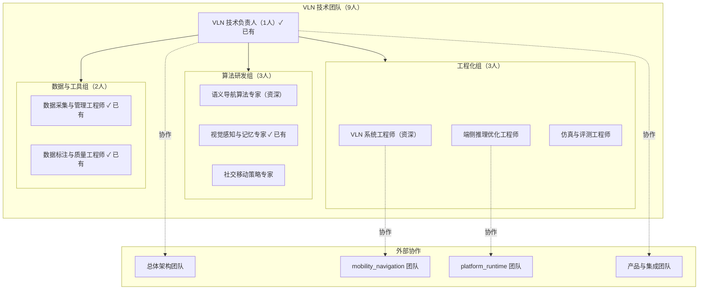
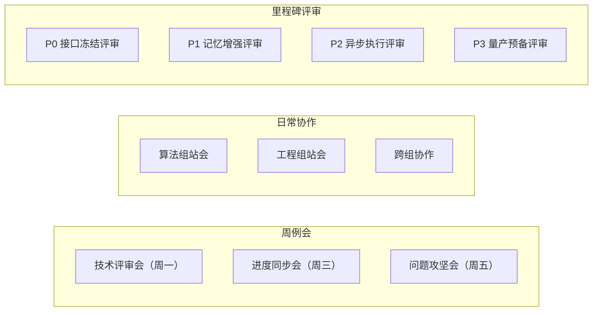

# Kinbot VLN 技术团队构建方案（8人新增编制）

---

文档版本：v1.0
创建日期：2026-03-27
作者：Codex-架构师

---

## 1. 文档定位

本文档是面向 Kinbot OODA 项目 VLN 技术线的**团队构建与工程化路线规划**。

**核心目标**：
1. 在原有 4 人基础上（1 名技术负责人 + 2 名数据工程师 + 1 名感知算法工程师），新增 5 人编制，构建完整的 VLN 技术团队
2. 明确各角色职责、技能要求与协作关系
3. 制定工程化路线图，支撑 2026-12-31 量产预备目标
4. 不涉及产品集成的具体细节，聚焦 VLN 技术能力建设

**适用范围**：
- VLN 技术线团队组建
- VLN 工程化能力建设
- VLN 研发流程与工具链建设

**不适用范围**：
- 整机产品集成方案（由总体架构团队负责）
- 其他模块（如 mobility_navigation、multimodal_interaction）的团队规划

---

## 2. 当前基线与约束

### 2.1 项目背景

根据 `docs/09_research/01_vln_role_analysis_and_technical_plan.md`，Kinbot 的 VLN 定位为：

1. **不是**底层运动控制器，而是 `Orient -> Decide` 之间的**语义导航策略层**
2. 负责"理解用户要去哪里、找什么、找谁、先搜哪里、找不到如何恢复"
3. 输出语义子目标、搜索策略、跟随约束和重规划建议
4. `Act` 层仍由 `mobility_navigation` 负责路径跟踪、局部规划、避障

### 2.2 技术现状

**已有基础**：
- 8B 室内寻物/寻人/到达能力（基于 VLN）
- 真实家庭数据采集能力
- 高精度重建设备
- 经典导航、SLAM、局部规划基础设施

**主要痛点**：
- 推理慢（VLN 推理和算法解算时间开销高）
- 走得犹豫
- 缺乏家庭语义记忆
- 缺乏异步执行机制
- 缺乏系统化的工程化能力

### 2.3 硬约束

1. **时间约束**：2026-12-31 达到量产预备状态
2. **成本约束**：整机物料成本 5000-6000 元人民币
3. **算力约束**：端侧算力优先考虑中国芯片（如进迭时空 K3、瑞芯微等）
4. **传感器约束**：纯视觉路线（1 组双目 + 2-3 个单目），不依赖激光雷达/深度相机
5. **团队规模**：当前约 25-30 人，未来几个月将达到 60 人以上
6. **预算约束**：周期内预算约 8000 万 - 1 亿人民币

---

## 3. 团队构建原则

### 3.1 组织原则

1. **技术深度优先**：VLN 是技术突破主战场，团队必须具备深度研发能力
2. **工程化并重**：不仅要做出 Demo，更要做出可量产的系统
3. **快速迭代**：支持 P0-P3 四阶段快速推进（详见第 7 章）
4. **协同优先**：与总体架构、mobility_navigation、platform_runtime 等团队紧密协作

### 3.2 角色设计原则

1. **职责清晰**：每个角色有明确的交付物和验收标准
2. **技能互补**：覆盖算法、工程、数据、系统四大领域
3. **梯队合理**：1 名技术负责人 + 2 名资深 + 5 名骨干
4. **成长空间**：为每个角色设计成长路径

---

## 4. 团队结构设计

### 4.1 整体架构

### 4.2 人员配置总览

| 角色 | 人数 | 级别 | 核心职责 | 状态 |
|------|------|------|----------|------|
| VLN 技术负责人 | 1 | 专家 | 技术方向、团队管理、对外协调 | ✓ 已有 |
| 多模态算法工程师（VLN方向） | 1 | 资深 | 视觉-语言导航算法研发 | 待招聘 |
| 机器人算法工程师（感知方向） | 1 | 骨干 | 视觉感知、空间记忆、场景理解 | ✓ 已有 |
| 多模态算法工程师（交互方向） | 1 | 骨干 | 社交导航、人机交互策略 | 待招聘 |
| 机器人系统工程师 | 1 | 资深 | 系统集成、ROS开发、异步执行 | 待招聘 |
| 模型部署工程师 | 1 | 骨干 | 模型量化、推理优化、端侧部署 | 待招聘 |
| 仿真与评测工程师 | 1 | 骨干 | 仿真环境、评测体系、Sim2Real | 待招聘 |
| 数据工程师 | 1 | 骨干 | 数据采集、清洗、管理、增强 | ✓ 已有 |
| 数据工程师 | 1 | 骨干 | 数据标注、质量控制、工具开发 | ✓ 已有 |

**总计**：9 人（已有 4 人 + 待招聘 5 人）

**当前团队构成**：
- ✓ VLN 技术负责人（1人）
- ✓ 机器人算法工程师-感知方向（1人）
- ✓ 数据工程师-采集与管理（1人）
- ✓ 数据工程师-标注与质量（1人）

**待招聘岗位**（5人）：
- 多模态算法工程师-VLN方向（资深）
- 多模态算法工程师-交互方向
- 机器人系统工程师（资深）
- 模型部署工程师
- 仿真与评测工程师

---

## 5. 各角色详细职责

### 5.1 VLN 技术负责人（1人，专家级）✓ 已有

**核心职责**：
1. 制定 VLN 技术路线，对齐总体架构与产品需求
2. 管理 VLN 团队，协调资源与优先级
3. 对外协调：与 mobility_navigation、platform_runtime、产品团队协作
4. 技术决策：模型选型、接口设计、工程化方案
5. 风险管理：识别技术风险，制定应对方案

**技能要求**：
- 5 年以上具身智能/机器人导航经验
- 深度理解 VLN/VLA 前沿进展
- 系统架构设计能力
- 团队管理经验
- 优秀的跨团队协作能力

**关键交付物**：
- VLN 技术路线图（P0-P3）
- VLN 接口规范（与其他模块的边界）
- 季度技术评审报告
- 团队 OKR 与绩效管理

**协作关系**：
- 向上：向总体架构师汇报技术方案
- 平级：与 mobility_navigation、platform_runtime 负责人协作
- 向下：管理算法组、工程组、数据组

---

### 5.2 多模态算法工程师-VLN方向（1人，资深级）

**岗位说明**：负责视觉-语言导航（VLN）和语义导航算法研发

**核心职责**：
1. 研发 `semantic_navigation_policy` 核心算法
2. 实现"找物、找人、到达、跟随、护送"等导航技能
3. 设计目标 belief state 维护机制
4. 优化语义子目标生成策略
5. 指导视觉感知专家的工作

**技能要求**：
- 3 年以上 VLN/具身智能经验
- 熟悉 Transformer、VLM、VLA 架构
- 熟悉 PyTorch/JAX 深度学习框架
- 了解家庭机器人导航场景
- 论文阅读与复现能力

**关键交付物**：
- `semantic_navigation_policy` 模型（P1-P2）
- 导航技能统一接口（P0）
- 目标 belief 更新算法（P1）
- 恢复策略设计文档（P2）
- 模型训练与评测报告

**协作关系**：
- 与视觉感知专家：定义空间记忆接口
- 与系统工程师：定义模型输入输出格式
- 与数据工程师：提出数据需求

**工作重点**：
- P0：冻结接口，定义输入输出
- P1：从动作输出改造为子目标输出
- P2：引入异步推理与快慢路径
- P3：家庭试点硬化与长尾优化

---

### 5.3 机器人算法工程师-感知方向（1人，骨干级）✓ 已有

**岗位说明**：负责视觉感知、空间记忆和场景理解算法研发

**核心职责**：
1. 建立家庭语义空间记忆系统
2. 实现房间识别、家具识别、目标候选排序
3. 设计 `spatial_memory_stack`（房间图、家具图、物品承载先验）
4. 实现多相机特征融合（BEV/topometric memory）
5. 支持目标遮挡恢复与重识别

**技能要求**：
- 2 年以上计算机视觉/场景理解经验
- 熟悉 VLM（如 Qwen3-VL）
- 了解 SLAM、场景图、拓扑地图
- 熟悉 Python、C++
- 数据结构与算法基础扎实

**关键交付物**：
- 房间/家具识别模块（P1）
- 家庭语义记忆数据库设计（P1）
- 目标候选排序算法（P1）
- BEV/topometric 混合表示（P2）
- 遮挡恢复与重识别模块（P2）

**协作关系**：
- 与语义导航专家：提供空间记忆查询接口
- 与数据工程师：定义家庭数据标注规范
- 与端侧优化工程师：优化推理性能

**工作重点**：
- P0：定义空间记忆数据结构
- P1：建立房间/家具/物品三层记忆
- P2：引入 BEV 与 topometric 融合
- P3：长期记忆更新与漂移检测

---

### 5.4 多模态算法工程师-交互方向（1人，骨干级）

**岗位说明**：负责社交导航和人机交互策略算法研发

**核心职责**：
1. 研发 `social_mobility_policy` 算法
2. 实现无指令共存移动、礼让、速度调节
3. 设计人机距离控制、让行判断、主动 reposition
4. 实现夜间静默移动、低扰动靠近
5. 设计 proxemic 约束与舒适性评估

**技能要求**：
- 2 年以上机器人导航/人机交互经验
- 了解社交导航（Social Navigation）
- 熟悉强化学习或行为规划
- 了解人因工程、proxemics
- 熟悉 Python、ROS

**关键交付物**：
- `social_mobility_policy` 算法（P2）
- 让行/礼让决策模块（P2）
- 人机距离控制策略（P2）
- 夜间静默移动策略（P2）
- 舒适性评估指标（P2）

**协作关系**：
- 与语义导航专家：共享 World State
- 与系统工程师：定义 costmap 调制接口
- 与 mobility_navigation 团队：对接局部规划器

**工作重点**：
- P0：定义社交移动策略接口
- P1：调研与原型验证
- P2：实现核心算法与集成
- P3：家庭试点优化

---

### 5.5 机器人系统工程师（1人，资深级）

**岗位说明**：负责 VLN 系统架构设计、ROS 开发和系统集成

**核心职责**：
1. 设计 VLN 系统架构与接口
2. 实现异步执行框架（语义推理与底盘控制解耦）
3. 集成 semantic_navigation_policy 与 social_mobility_policy
4. 对接 mobility_navigation、world_state_memory
5. 实现故障恢复与降级策略

**技能要求**：
- 3 年以上机器人系统开发经验
- 熟悉 ROS/ROS2
- 熟悉 C++、Python
- 了解实时系统、异步编程
- 系统调试与性能优化能力

**关键交付物**：
- VLN 系统架构设计文档（P0）
- 异步执行框架（P1）
- VLN 与 mobility_navigation 接口实现（P1）
- 故障恢复与降级模块（P2）
- 系统集成测试报告（P3）

**协作关系**：
- 与算法组：定义模型部署接口
- 与 mobility_navigation 团队：对接局部规划
- 与 platform_runtime 团队：对接算力调度
- 与端侧优化工程师：优化推理流程

**工作重点**：
- P0：冻结接口，搭建系统框架
- P1：实现异步执行与模型集成
- P2：故障恢复与性能优化
- P3：系统稳定性硬化

---

### 5.6 模型部署工程师（1人，骨干级）

**岗位说明**：负责 AI 模型端侧部署、推理优化和量化加速

**核心职责**：
1. 适配端侧芯片（如进迭时空 K3、瑞芯微）
2. 模型量化（FP8/INT8）与推理加速
3. 优化 TTFT（首 token 时延）与 TPS（吞吐）
4. 实现多模型并发调度（ViT + LLM）
5. 功耗与热管理优化

**技能要求**：
- 2 年以上模型部署/推理优化经验
- 熟悉 ONNX、TensorRT、llama.cpp
- 了解模型量化、剪枝、蒸馏
- 熟悉 C++、CUDA/OpenCL
- 了解嵌入式系统

**关键交付物**：
- 端侧推理引擎适配（P1）
- 模型量化方案（P1）
- TTFT/TPS 优化报告（P2）
- 多模型并发调度器（P2）
- 功耗优化方案（P2）

**协作关系**：
- 与算法组：模型导出与量化
- 与系统工程师：推理引擎集成
- 与 platform_runtime 团队：算力调度协同

**工作重点**：
- P0：评估端侧芯片能力
- P1：完成模型量化与部署
- P2：优化推理性能与功耗
- P3：长期稳定性验证

---

### 5.7 仿真与评测工程师（1人，骨干级）

**核心职责**：
1. 搭建家庭场景仿真环境（基于 Habitat/Isaac Sim）
2. 设计 VLN 评测体系（成功率、SPL、犹豫时间等）
3. 实现 Sim2Real 验证流程
4. 建立回归测试与 CI/CD
5. 支持算法快速迭代

**技能要求**：
- 2 年以上机器人仿真/测试经验
- 熟悉 Habitat、Isaac Sim、Gazebo
- 熟悉 Python、ROS
- 了解 VLN 评测指标
- 自动化测试与 CI/CD 经验

**关键交付物**：
- 家庭场景仿真环境（P0）
- VLN 评测指标体系（P0）
- Sim2Real 验证流程（P1）
- 回归测试套件（P2）
- CI/CD 流水线（P2）

**协作关系**：
- 与算法组：提供仿真环境与评测
- 与数据工程师：仿真数据生成
- 与系统工程师：真机测试协同

**工作重点**：
- P0：搭建仿真环境与评测体系
- P1：Sim2Real 验证与迭代
- P2：自动化测试与 CI/CD
- P3：长尾场景覆盖

---

### 5.8 数据工程师-采集与管理（1人，骨干级）✓ 已有

**岗位说明**：负责数据采集、清洗、管理和增强

**核心职责**：
1. 设计数据采集方案（多相机同步、标定）
2. 建立数据管理平台（存储、检索、版本管理）
3. 实现数据增强与合成数据生成
4. 支持数据回放与可视化
5. 管理真实家庭数据资产

**技能要求**：
- 2 年以上数据工程经验
- 熟悉 Python、SQL
- 了解计算机视觉数据处理
- 熟悉数据库（PostgreSQL/MongoDB）
- 了解数据隐私与安全

**关键交付物**：
- 数据采集工具链（P0）
- 数据管理平台（P1）
- 数据增强流程（P1）
- 数据回放与可视化工具（P1）
- 真实家庭数据集（P2-P3）

**协作关系**：
- 与算法组：提供训练数据
- 与标注工程师：数据标注流程
- 与仿真工程师：合成数据生成

**工作重点**：
- P0：搭建数据采集与管理基础设施
- P1：建立数据增强与回放能力
- P2：积累真实家庭数据
- P3：数据质量持续优化

---

### 5.9 数据工程师-标注与质量（1人，骨干级）✓ 已有

**岗位说明**：负责数据标注、质量控制和标注工具开发

**核心职责**：
1. 设计数据标注规范（房间、家具、目标、轨迹）
2. 使用教师模型（如 Qwen3-VL）辅助标注
3. 建立标注质量控制流程
4. 管理标注团队（外包或内部）
5. 数据质量评估与反馈

**技能要求**：
- 2 年以上数据标注/质量管理经验
- 熟悉计算机视觉标注工具
- 了解 VLM 使用
- 熟悉 Python
- 质量管理与流程优化能力

**关键交付物**：
- 数据标注规范（P0）
- 标注工具与流程（P1）
- 教师模型标注系统（P1）
- 质量控制报告（P2-P3）
- 标注数据集（P2-P3）

**协作关系**：
- 与算法组：定义标注需求
- 与数据工程师：标注数据管理
- 与外部标注团队：质量管理

**工作重点**：
- P0：制定标注规范
- P1：搭建标注工具与流程
- P2：规模化标注与质量控制
- P3：持续优化标注质量

---

## 6. 团队协作机制

### 6.1 组织结构

### 6.2 协作规则

**算法组内部**：
- 语义导航专家 ↔ 视觉感知专家：空间记忆接口
- 语义导航专家 ↔ 社交移动专家：World State 共享
- 每周一次算法评审会

**工程组内部**：
- 系统工程师 ↔ 端侧优化工程师：推理引擎集成
- 系统工程师 ↔ 仿真工程师：测试验证
- 每周一次工程评审会

**跨组协作**：
- 算法组 → 工程组：模型交付
- 算法组 → 数据组：数据需求
- 工程组 → 数据组：工具需求

**外部协作**：
- VLN 负责人 ↔ 总体架构师：方案对齐
- 系统工程师 ↔ mobility_navigation：接口联调
- 端侧优化工程师 ↔ platform_runtime：算力调度

### 6.3 质量保证

- 代码评审：所有代码必须 Code Review
- 测试覆盖：单元测试 > 70%，集成测试覆盖核心场景
- 文档同步：接口文档与代码同步更新

---

## 7. 工程化路线图（P0-P3）

### 7.1 P0：接口冻结与评测定义（2026-03-27 至 2026-04-15）

**目标**：明确 VLN 角色边界，冻结接口，建立评测体系

**关键任务**：

| 任务 | 负责人 | 交付物 | 截止 |
|------|--------|--------|------|
| VLN 技术路线图 | 技术负责人 | 路线图文档 | 04-05 |
| semantic_navigation_policy 接口 | 语义导航专家 + 系统工程师 | 接口规范 v1.0 | 04-10 |
| social_mobility_policy 接口 | 社交移动专家 + 系统工程师 | 接口规范 v1.0 | 04-10 |
| 空间记忆数据结构 | 视觉感知专家 | 数据结构文档 | 04-08 |
| 仿真环境搭建 | 仿真工程师 | 仿真环境 v0.1 | 04-12 |
| 评测指标体系 | 仿真工程师 + 技术负责人 | 评测规范 v1.0 | 04-15 |
| 数据采集工具 | 数据工程师 | 采集工具 v0.1 | 04-10 |
| 标注规范 | 标注工程师 | 标注规范 v1.0 | 04-12 |

**里程碑评审**（2026-04-15）：
- 接口规范清晰可执行
- 评测体系可落地
- 工具链基本可用

---

### 7.2 P1：记忆增强与子目标化（2026-04-16 至 2026-06-30）

**目标**：从动作输出改为子目标输出，建立语义记忆

**关键任务**：

| 任务 | 负责人 | 交付物 | 截止 |
|------|--------|--------|------|
| 子目标输出模型 | 语义导航专家 | 模型 v1.0 | 05-31 |
| 房间/家具识别 | 视觉感知专家 | 识别模块 v1.0 | 05-15 |
| 语义记忆数据库 | 视觉感知专家 | 数据库 v1.0 | 05-31 |
| 目标 belief 维护 | 语义导航专家 | Belief 模块 v1.0 | 06-15 |
| 异步执行框架 | 系统工程师 | 框架 v1.0 | 05-31 |
| 端侧推理引擎 | 端侧优化工程师 | 引擎 v1.0 | 06-15 |
| 模型量化 | 端侧优化工程师 | 量化模型 v1.0 | 06-30 |
| 数据管理平台 | 数据工程师 | 平台 v1.0 | 05-31 |
| 标注工具 | 标注工程师 | 工具 v1.0 | 05-15 |
| Sim2Real 验证 | 仿真工程师 | 验证流程 v1.0 | 06-30 |

**里程碑评审**（2026-06-30）：
- 子目标模型可用
- 语义记忆稳定
- 异步框架可集成

---

### 7.3 P2：异步执行与专项能力强化（2026-07-01 至 2026-09-30）

**目标**：异步化推理执行，强化人跟随与社交导航

**关键任务**：

| 任务 | 负责人 | 交付物 | 截止 |
|------|--------|--------|------|
| 快慢路径推理 | 语义导航专家 | 推理机制 v1.0 | 08-15 |
| 人跟随专项 | 语义导航专家 | 跟随模块 v1.0 | 08-31 |
| social_mobility_policy | 社交移动专家 | 策略模块 v1.0 | 09-15 |
| BEV/topometric 混合 | 视觉感知专家 | 表示模块 v1.0 | 08-31 |
| 遮挡恢复 | 视觉感知专家 | 恢复模块 v1.0 | 09-15 |
| 故障降级 | 系统工程师 | 降级模块 v1.0 | 08-31 |
| TTFT/TPS 优化 | 端侧优化工程师 | 优化报告 | 08-15 |
| 多模型并发 | 端侧优化工程师 | 调度器 v1.0 | 09-15 |
| 回归测试 | 仿真工程师 | 测试套件 v1.0 | 08-31 |
| CI/CD 流水线 | 仿真工程师 | 流水线 v1.0 | 09-15 |
| 真实家庭数据集 | 数据组 | 数据集 v1.0 | 09-30 |

**里程碑评审**（2026-09-30）：
- 异步执行性能达标
- 社交导航功能完整
- 数据集质量充足

---

### 7.4 P3：家庭试点硬化（2026-10-01 至 2026-12-31）

**目标**：试点验证，建立故障闭环，量产预备

**关键任务**：

| 任务 | 负责人 | 交付物 | 截止 |
|------|--------|--------|------|
| 试点部署 | 全员 | 部署报告 | 10-31 |
| 长尾优化 | 算法组 | 优化报告 | 11-30 |
| 故障闭环 | 系统工程师 | 处理流程 | 11-15 |
| 性能验证 | 端侧优化工程师 | 性能报告 | 11-30 |
| 数据质量优化 | 数据组 | 质量报告 | 12-15 |
| 量产预备材料 | 技术负责人 | 评审包 | 12-20 |
| 最终验收 | 全员 | 验收报告 | 12-31 |

**里程碑评审**（2026-12-31）：
- 试点成功率达标
- 故障可控可恢复
- 满足量产预备条件

---

## 8. 关键技术挑战与应对

### 8.1 纯视觉路线挑战

**挑战**：
- 低光/逆光场景深度估计不稳定
- 玻璃、镜面、细障碍物识别困难
- 动态人宠快速切入的安全性

**应对策略**：
1. **多相机融合**：前向双目 + 侧向单目，提供几何冗余
2. **不确定性门控**：显式建模不确定性，触发慢速/停止/重观察
3. **教师-学生架构**：用大模型标注，小模型执行
4. **Sim2Real 验证**：仿真环境覆盖长尾场景

**责任分工**：
- 视觉感知专家：深度估计与融合
- 端侧优化工程师：推理性能优化
- 仿真工程师：长尾场景仿真

---

### 8.2 端侧算力约束

**挑战**：
- 8B 模型端侧推理慢（TTFT > 1s）
- 多模型并发（ViT + LLM）带宽受限
- 功耗与热管理压力

**应对策略**：
1. **模型量化**：FP8/INT8 量化，降低计算量
2. **异步执行**：语义推理 1-3Hz，安全控制 10-50Hz
3. **快慢路径**：简单场景用小模型，复杂场景触发大模型
4. **芯片适配**：针对进迭时空 K3 等芯片深度优化

**责任分工**：
- 端侧优化工程师：量化与推理优化
- 系统工程师：异步框架设计
- 语义导航专家：快慢路径策略

---

### 8.3 家庭语义记忆

**挑战**：
- 家具移动后记忆失效
- 相似物体混淆（多个杯子、多个遥控器）
- 长期记忆更新与漂移检测

**应对策略**：
1. **分层记忆**：房间层（稳定）、家具层（中等）、物品层（动态）
2. **置信度衰减**：长时间未观测的记忆降低置信度
3. **主动验证**：定期巡逻更新记忆
4. **用户反馈**：允许用户纠正记忆

**责任分工**：
- 视觉感知专家：记忆系统设计
- 数据工程师：记忆数据管理
- 语义导航专家：记忆查询与更新

---

### 8.4 Sim2Real 鸿沟

**挑战**：
- 仿真环境与真实家庭差异大
- 光照、纹理、物理特性难以完全模拟
- 人的行为模式难以建模

**应对策略**：
1. **真实数据优先**：尽早采集真实家庭数据
2. **Domain Randomization**：仿真环境随机化
3. **渐进式验证**：仿真 → 实验室 → 试点家庭
4. **人在环测试**：早期引入真实用户

**责任分工**：
- 仿真工程师：仿真环境优化
- 数据工程师：真实数据采集
- 全员：试点验证

---

## 9. 招聘与岗位画像

### 9.1 招聘优先级

**当前团队（4人）**：
1. ✓ **VLN 技术负责人**（专家级）
2. ✓ **机器人算法工程师-感知方向**（骨干级）
3. ✓ **数据工程师-采集与管理**（骨干级）
4. ✓ **数据工程师-标注与质量**（骨干级）

**第一批招聘（2026-04 前，2人）**：
1. **多模态算法工程师-VLN方向**（资深，最高优先级）
2. **机器人系统工程师**（资深，最高优先级）

**第二批招聘（2026-05 前，2人）**：
3. **模型部署工程师**（骨干）
4. **仿真与评测工程师**（骨干）

**第三批招聘（2026-06 前，1人）**：
5. **多模态算法工程师-交互方向**（骨干）

**招聘策略说明**：
- 第一批聚焦核心算法和系统集成能力，是 P0-P1 阶段的关键
- 第二批聚焦工程化能力，支撑 P1-P2 阶段的推理优化和测试验证
- 第三批补充社交导航能力，支撑 P2 阶段的专项能力强化
- 数据团队已配齐，可立即启动数据采集和标注工作

---

### 9.2 岗位画像详解

**说明**：以下仅列出待招聘岗位的详细画像。已有团队成员（技术负责人、感知算法工程师、数据团队）的能力要求已在第 5 章各角色职责中描述。

---

#### 9.2.1 多模态算法工程师-VLN方向（资深）【待招聘，最高优先级】

**岗位定位**：负责视觉-语言导航（VLN）算法研发。市场上常见岗位名称包括"多模态算法工程师"、"VLN算法工程师"、"具身智能算法工程师"等，本岗位专注于视觉-语言融合的导航算法方向。

**理想背景**：
- 硕士及以上，计算机视觉/机器人方向
- 3 年以上 VLN/具身智能研发经验
- 熟悉 Transformer、VLM、VLA 架构
- 有论文复现或开源贡献

**核心能力**：
- 算法能力：深度学习模型设计与训练
- 工程能力：PyTorch/JAX 熟练，代码质量高
- 问题分析：快速定位问题，提出解决方案
- 学习能力：快速学习新技术

**加分项**：
- 有 VLN benchmark 刷榜经验
- 有多模态大模型微调经验
- 有机器人真机部署经验
- 熟悉强化学习

**面试重点**：
- 算法深度：VLN 核心算法原理，现场算法设计
- 代码能力：现场编程，GitHub 代码评审
- 论文理解：给定论文，讲解核心思想
- 实战经验：过往项目难点与解决方案

---

#### 9.2.2 机器人系统工程师（资深）【待招聘，最高优先级】

**岗位定位**：负责机器人系统架构设计和 ROS 开发，这是市场上通用的"机器人系统工程师"或"ROS开发工程师"岗位。

**理想背景**：
- 本科及以上，计算机/自动化/机器人方向
- 3 年以上机器人系统开发经验
- 熟悉 ROS/ROS2，C++/Python 精通
- 有完整系统集成经验

**核心能力**：
- 系统设计：模块化架构，接口设计
- 工程能力：代码质量高，调试能力强
- 性能优化：实时系统，异步编程
- 协作能力：跨团队接口对接

**加分项**：
- 有机器人导航系统开发经验
- 有实时系统开发经验
- 有大型项目架构经验
- 熟悉 Docker/K8s

**面试重点**：
- 系统设计：现场系统架构设计题
- 代码能力：C++ 编程，多线程/异步
- 调试能力：给定 bug，分析定位
- 工程经验：过往系统复杂度，性能优化案例

---

#### 9.2.3 多模态算法工程师-交互方向【待招聘】

**岗位定位**：负责社交导航和人机交互策略研发。市场上常见岗位名称包括"多模态算法工程师"、"具身智能算法工程师"等，本岗位专注于人机交互和社交导航方向。

**理想背景**：
- 硕士及以上，机器人/人机交互方向
- 2 年以上机器人导航或人机交互经验
- 了解社交导航（Social Navigation）
- 有行为规划或强化学习经验

**核心能力**：
- 算法能力：行为规划，强化学习
- 人因理解：proxemics，舒适性
- 工程能力：Python/ROS 熟练
- 创新能力：新问题建模

**加分项**：
- 有社交机器人研发经验
- 有人机交互研究经验
- 有强化学习实战经验
- 有心理学/人因工程背景

**面试重点**：
- 问题理解：社交导航场景分析
- 算法设计：现场算法设计题
- 代码能力：现场编程
- 创新思维：新场景建模能力

---

#### 9.2.4 模型部署工程师【待招聘】

**岗位定位**：负责 AI 模型端侧部署和推理优化，这是市场上通用的"模型部署工程师"或"AI推理优化工程师"岗位。

**理想背景**：
- 本科及以上，计算机/电子工程方向
- 2 年以上模型部署/推理优化经验
- 熟悉 ONNX、TensorRT、llama.cpp
- 有嵌入式或边缘设备开发经验

**核心能力**：
- 模型优化：量化、剪枝、蒸馏
- 推理引擎：TensorRT、ONNX Runtime
- 性能调优：profiling、bottleneck 分析
- 硬件理解：GPU/NPU 架构

**加分项**：
- 有端侧大模型部署经验
- 有 CUDA/OpenCL 开发经验
- 有芯片适配经验（如瑞芯微、进迭时空）
- 有功耗优化经验

**面试重点**：
- 优化能力：模型量化原理，现场优化方案设计
- 工程能力：C++ 编程，性能分析
- 硬件理解：GPU/NPU 架构，内存带宽
- 实战经验：过往优化案例，性能提升数据

---

#### 9.2.5 仿真与评测工程师【待招聘】

**理想背景**：
- 本科及以上，计算机/机器人方向
- 2 年以上机器人仿真/测试经验
- 熟悉 Habitat、Isaac Sim、Gazebo
- 有自动化测试经验

**核心能力**：
- 仿真开发：场景搭建，物理仿真
- 测试设计：测试用例，评测指标
- 工程能力：Python/ROS 熟练
- 自动化：CI/CD，脚本开发

**加分项**：
- 有 VLN benchmark 评测经验
- 有 Sim2Real 验证经验
- 有 Unity/Unreal 开发经验
- 有性能测试经验

**面试重点**：
- 仿真能力：仿真环境搭建，物理引擎理解
- 测试设计：测试用例设计，覆盖率分析
- 代码能力：现场编程，脚本开发
- 工程经验：过往测试项目，自动化程度

---

## 10. 总结与展望

### 10.1 团队能力矩阵

本方案构建的 9 人 VLN 技术团队，覆盖以下核心能力域：

| 能力域 | 覆盖角色 | 能力成熟度目标 |
|--------|----------|----------------|
| **算法研发** | 语义导航专家、视觉感知专家、社交移动专家 | P3 达到行业 SOTA 水平 |
| **系统集成** | VLN 系统工程师 | P2 实现异步执行与故障恢复 |
| **端侧优化** | 端侧推理优化工程师 | P2 达到量化推理性能目标 |
| **仿真评测** | 仿真与评测工程师 | P1 建立 Sim2Real 验证闭环 |
| **数据工程** | 数据工程师、标注工程师 | P2 积累真实家庭数据集 |
| **技术管理** | VLN 技术负责人 | 全周期技术决策与协调 |

**关键能力指标**：

- **算法能力**：8B 室内导航模型，端侧推理 < 1s TTFT
- **工程能力**：异步执行框架，故障降级机制，CI/CD 流水线
- **数据能力**：真实家庭数据集，标注质量控制，数据增强
- **协作能力**：跨团队接口对齐，模块并行开发

---

### 10.2 关键成功因素

#### 10.2.1 技术突破

1. **纯视觉导航**：必须在 P2 阶段验证纯视觉方案可行性，否则触发产品节奏延迟
2. **端侧推理**：必须在 P1 阶段完成模型量化与部署，确保推理性能达标
3. **语义记忆**：必须在 P1 阶段建立稳定的家庭语义记忆系统

#### 10.2.2 团队协作

1. **接口冻结**：P0 阶段必须冻结 VLN 与其他模块的接口，避免后期返工
2. **并行开发**：算法组、工程组、数据组必须并行推进，避免串行阻塞
3. **快速迭代**：每个阶段必须有明确的里程碑评审，快速发现问题并调整

#### 10.2.3 资源保障

1. **招聘节奏**：第一批 2 人（语义导航专家、系统工程师）必须在 2026-04 前到位，第二批 2 人在 2026-05 前到位
2. **硬件资源**：端侧芯片、相机、底盘等硬件必须在 P0 阶段确定选型
3. **数据资源**：真实家庭数据采集已具备条件，必须在 P1 阶段启动
4. **现有团队优势**：数据团队已配齐，感知算法已有基础，可加速 P0-P1 推进

---

### 10.3 风险缓解策略

#### 10.3.1 技术风险

| 风险 | 缓解策略 | 责任人 |
|------|----------|--------|
| 纯视觉方案不可行 | P1 阶段设置技术评审门，不通过则延迟产品节奏 | 技术负责人 |
| 端侧算力不足 | P0 阶段评估多款芯片，保留备选方案 | 端侧优化工程师 |
| 语义记忆不稳定 | P1 阶段设置 Sim2Real 验证门，不通过则重构 | 视觉感知专家 |
| Sim2Real 鸿沟 | P1 阶段尽早采集真实数据，P2 阶段试点验证 | 仿真工程师 + 数据工程师 |

#### 10.3.2 团队风险

| 风险 | 缓解策略 | 责任人 |
|------|----------|--------|
| 关键人员招聘延迟 | 提前启动招聘，设置备选候选人池；优先招聘语义导航专家和系统工程师 | 技术负责人 |
| 团队协作不畅 | 建立周例会与跨组协作机制，明确接口责任 | 技术负责人 |
| 技术方向分歧 | 建立技术决策机制，技术负责人拍板 | 技术负责人 |
| 现有团队能力不匹配 | P0 阶段评估现有团队能力，必要时调整分工或补充培训 | 技术负责人 |

#### 10.3.3 进度风险

| 风险 | 缓解策略 | 责任人 |
|------|----------|--------|
| P0 接口冻结延迟 | 设置硬截止日期，优先冻结核心接口 | 技术负责人 + 系统工程师 |
| P1 记忆增强延迟 | 设置最小可用版本（MVP），优先保证核心功能 | 语义导航专家 + 视觉感知专家 |
| P2 异步执行延迟 | 设置降级方案，优先保证功能完整性 | VLN 系统工程师 |
| P3 试点验证失败 | 设置故障闭环机制，快速迭代优化 | 全员 |

---

### 10.4 预期成果（2026-12-31）

#### 10.4.1 技术成果

1. **VLN 核心能力**：
   - 8B 室内寻物/寻人/到达能力，端侧推理 < 1s TTFT
   - 家庭语义记忆系统，支持房间/家具/物品三层记忆
   - 异步执行框架，语义推理 1-3Hz，安全控制 10-50Hz
   - 社交移动策略，支持让行/礼让/人机距离控制

2. **工程化能力**：
   - 仿真环境与评测体系，支持 Sim2Real 验证
   - 数据管理平台，支持真实家庭数据采集与标注
   - CI/CD 流水线，支持自动化测试与回归测试
   - 故障降级机制，支持传感器失效/网络断开等异常场景

3. **数据资产**：
   - 真实家庭数据集（100 户，1 个月）
   - 标注数据集（房间/家具/物品/轨迹）
   - 仿真数据集（长尾场景覆盖）

#### 10.4.2 团队成果

1. **团队规模**：9 人（1 名技术负责人 + 3 名算法专家 + 3 名工程师 + 2 名数据专家）
2. **团队能力**：覆盖算法、工程、数据、系统四大领域，具备深度研发与工程化能力
3. **协作机制**：建立周例会、跨组协作、里程碑评审等机制，支持快速迭代
4. **团队构成**：
   - 已有 4 人（技术负责人、视觉感知专家、2 名数据工程师）
   - 待招聘 5 人（语义导航专家、系统工程师、社交移动专家、端侧优化工程师、仿真工程师）

#### 10.4.3 量产预备

1. **小批量试点**：100 台，100 户，1 个月
2. **试点成功率**：核心导航功能成功率 > 90%
3. **故障可控**：关键故障可降级，非关键故障可恢复
4. **随时可开发布会**：产品定型，技术方案冻结，工程化能力就绪

---

### 10.5 后续演进方向

#### 10.5.1 第二代产品（2027-2028）

1. **算法演进**：
   - 引入更大规模的多模态模型（如 30B+）
   - 引入 World Model，支持预测与仿真
   - 引入自主探索与主动学习

2. **工程演进**：
   - 云端协同推理，端侧负责实时控制，云端负责复杂推理
   - 多机器人协同，支持家庭多机器人场景
   - 长期记忆更新与漂移检测

3. **数据演进**：
   - 积累更大规模的真实家庭数据
   - 引入用户反馈闭环，持续优化模型
   - 引入迁移学习，支持新家庭快速适配

#### 10.5.2 团队演进

1. **团队扩展**：根据产品演进需求，适时扩展团队规模
2. **能力深化**：在算法、工程、数据等领域持续深化能力
3. **生态建设**：建立 VLN 技术生态，吸引外部合作伙伴

---

### 10.6 结语

本方案构建的 9 人 VLN 技术团队，是 Kinbot OODA 项目实现 2026-12-31 量产预备目标的关键支撑。团队覆盖算法、工程、数据、系统四大领域，具备深度研发与工程化能力，能够支撑 P0-P3 四阶段快速推进。

**当前团队优势**：
- ✓ 技术负责人已到位，可立即启动技术路线规划
- ✓ 视觉感知专家已到位，可立即启动空间记忆系统设计
- ✓ 数据团队已配齐（2人），可立即启动数据采集和标注工作
- 数据基础设施建设可与算法研发并行推进，加速整体进度

**核心理念**：

1. **技术深度优先**：VLN 是技术突破主战场，团队必须具备深度研发能力
2. **工程化并重**：不仅要做出 Demo，更要做出可量产的系统
3. **快速迭代**：支持 P0-P3 四阶段快速推进，每个阶段有明确的里程碑评审
4. **协同优先**：与总体架构、mobility_navigation、platform_runtime 等团队紧密协作

**关键挑战**：

1. **纯视觉路线**：必须在 P2 阶段验证纯视觉方案可行性
2. **端侧算力约束**：必须在 P1 阶段完成模型量化与部署
3. **家庭语义记忆**：必须在 P1 阶段建立稳定的语义记忆系统
4. **Sim2Real 鸿沟**：必须在 P2 阶段完成 Sim2Real 验证

**成功路径**：

1. **P0（2026-03-27 至 2026-04-15）**：冻结接口，建立评测体系
2. **P1（2026-04-16 至 2026-06-30）**：记忆增强，子目标化，异步框架
3. **P2（2026-07-01 至 2026-09-30）**：异步执行，社交导航，数据积累
4. **P3（2026-10-01 至 2026-12-31）**：试点验证，故障闭环，量产预备

通过本方案的实施，Kinbot VLN 技术团队将在 2026-12-31 前达到量产预备状态，为 Kinbot OODA 项目的成功奠定坚实基础。

---

**文档版本**：v1.0  
**创建日期**：2026-03-27  
**作者**：Codex-架构师  
**审核状态**：待审核

---
